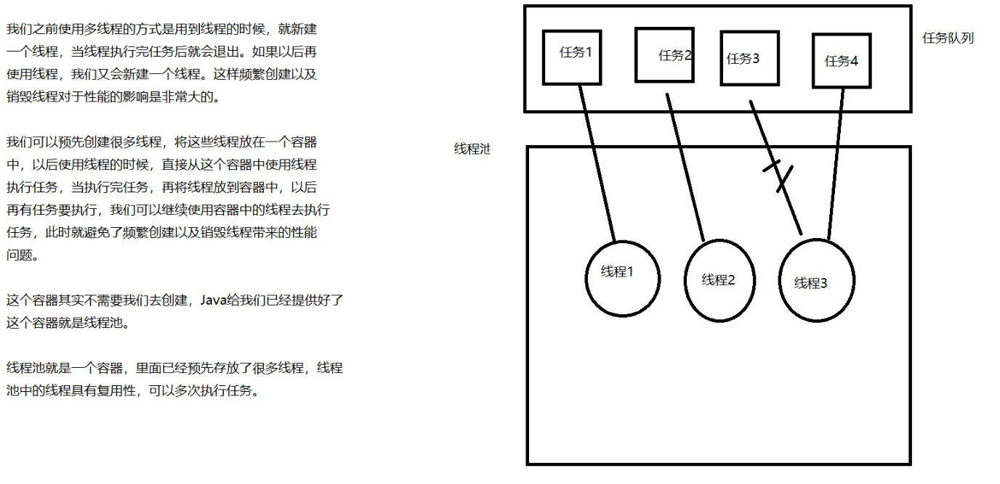
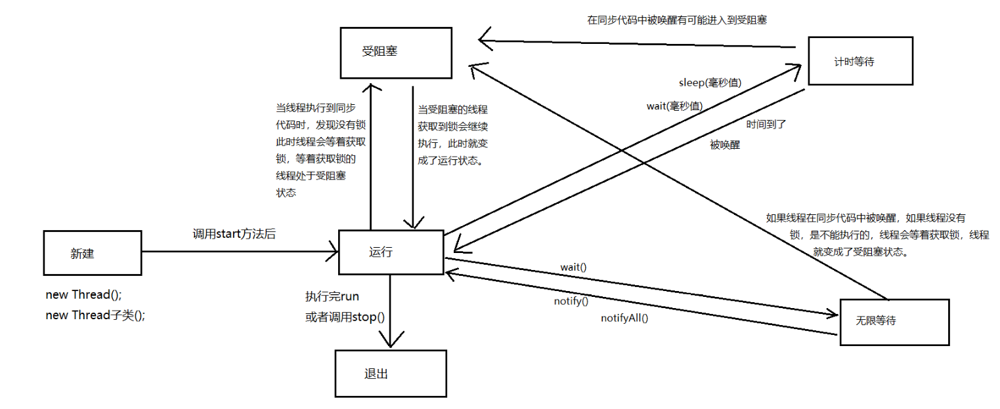
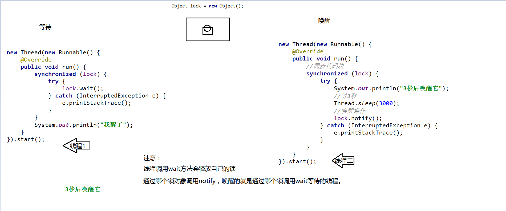
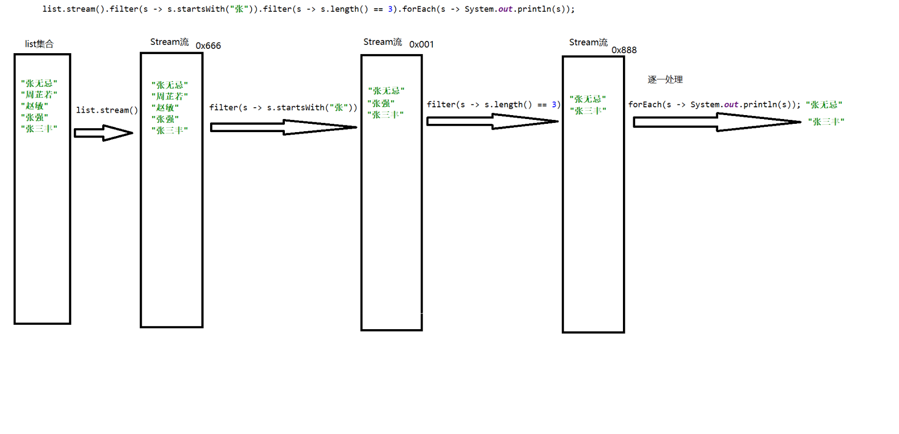

# 线程池

## 线程池介绍



## 线程池的基本使用【重要】

```java
/*
    线程池是一个容器，里面存放了很多线程，里面的线程可以多次执行任务。

    线程池相关API：
        Executor：接口，是所有线程池的根接口。这个接口中提供了提交线程任务的方法。
        ExecutorService：是Executor的子接口，也表示线程池。 这个接口中不仅提供了提交线程任务的方法，还提供了管理线程池的方法。
        Executors：线程池的工具类，里面提供了获取线程池的方法。

    注意：线程池对象不是由我们自己new的，而是要通过工具类Executors进行获取

    Executors中获取线程池的方法：
        static ExecutorService newFixedThreadPool(int nThreads)：获取一个定长的线程池。参数表示线程池的长度。

    ExecutorService表示线程池，里面方法：
        submit(Runnable task)：提交线程任务并执行。
        shutdown()：销毁线程池

    线程池的使用步骤：
        1. 通过Executors工具类获取线程池。
        2. 调用线程池的submit方法，提交并执行线程任务。
        3. 销毁线程池（一般不做）
 */
public class Demo01ThreadPool {
    public static void main(String[] args) {
        //通过Executors工具类获取线程池。
        ExecutorService threadPool = Executors.newFixedThreadPool(2);
        //调用线程池的submit方法，提交并执行线程任务。
        Task task = new Task();//线程任务对象
        threadPool.submit(task);
        threadPool.submit(task);
        threadPool.submit(task);
        //销毁线程池（一般不做）
        //threadPool.shutdown();
    }
}
```

```java
public class Task implements Runnable{
    //线程要执行的任务
    @Override
    public void run() {
        //输出100次HelloWorld
        for (int i = 1; i <= 100; i++) {
            System.out.println(Thread.currentThread().getName() + "在输出HelloWorld：" + i);
        }
    }
}

```

## Callable方式完成多线程【了解】

```java
/*
    多线程的第三种实现方式（实现Callable接口方式（了解））

    步骤：
        1. 定义类，实现Callable接口
        2. 重写Callable接口中的call方法，在call方法中定义线程要执行的任务。
        3. 获取线程池。
        4. 通过线程池调用submit方法，传递Callable接口的实现类对象，去执行该任务。
        5. 处理结果。

    线程池中提交任务的方法：
        <T> Future<T> submit(Callable<T> task)：提交线程任务。返回值是Future类型

    Future封装了线程执行后的结果。
        V get()：获取到线程执行后的结果。
 */
public class Demo01Callable {
    public static void main(String[] args) throws ExecutionException, InterruptedException {
        //获取线程池
        ExecutorService threadPool = Executors.newFixedThreadPool(2);
        //通过线程池调用submit方法，传递Callable接口的实现类对象，去执行该任务。
        Future<String> future = threadPool.submit(new CallableImpl());
        //V get()：获取到线程执行后的结果。
        String str = future.get();
        System.out.println(str);
    }
}
```

```java
public class CallableImpl implements Callable<String>{
    //编写线程要执行的任务
    @Override
    public String call() throws Exception {
        for (int i = 0; i < 100; i++) {
            System.out.println("HelloWorld");
        }
        //线程执行后的结果
        return "狗蛋";
    }
}

```

# 线程状态

## 线程六种状态

```java
/*
    线程状态

    新建（NEW）：刚刚创建出来但是没有运行的线程处于此状态。
    运行（RUNNABLE）：调用start方法启动后的线程处于运行状态。
    受阻塞（BLOCKED）：等待获取锁的线程处于此状态。
    无限等待（WAITING）：当线程调用wait()方法时，线程会处于无限等待状态【没有时间的等待】
    计时等待（TIMED_WAITING）：当线程调用wait(毫秒值)方法或sleep(毫秒值)时，线程会处于计时等待状态【有时间的等待】
    退出（TERMINATED）：当线程执行完了自己的run方法或者调用了stop方法，会进入退出状态。
 */
public class Demo01State {

}

```

## 线程状态图



## wait和notify介绍【了解】

```java
/*
    在Object中，有两种方法可以让线程等待以及唤醒线程。
        void wait()：线程等待，直到其他线程唤醒该线程。
        void wait(long timeout)：线程等待，直到其他线程唤醒该线程或者指定的时间已到。
        void notify()：唤醒一个线程。
        void notifyAll()：唤醒所有线程。

    wait和notify方法是Object中的方法，不是Thread中。
    注意：
        wait和notify一定要写在同步代码中，要通过锁对象调用。

        通过哪个锁对象调用的notify方法，唤醒的就是通过哪个锁对象调用wait等待的线程
 */
```

```java
/*
    在Object中，有两种方法可以让线程等待以及唤醒等待的线程。
        void wait()：让线程等待，直到其他线程唤醒它。
        void wait(long timeout)：让线程等待，直到其他线程唤醒它，或者时间到了。
        void notify()：唤醒一个线程。
        void notifyAll()：唤醒所有的线程。

    wait和notify不是Thread中的方法，而是Object中的方法。

    注意：
        wait和notify一定要放到同步代码块【同步方法】，并且通过锁对象调用。

        【通过哪个锁调用的notify，那么唤醒的就是通过哪个锁调用wait等待的线程】

 */
public class Demo02Wait {
    public static void main(String[] args) {
        //创建对象，当做锁
        Object lock = new Object();
        //创建线程【等待】
        new Thread(new Runnable() {
            @Override
            public void run() {
                //同步代码块
                synchronized (lock) {
                    try {
                        //通过锁对象调用wait方法让线程等待
                        lock.wait();
                    } catch (InterruptedException e) {
                        e.printStackTrace();
                    }
                }
                System.out.println("我醒了");
            }
        }).start();
        //创建线程【唤醒】
        new Thread(new Runnable() {
            @Override
            public void run() {
                //同步代码块
                synchronized (lock) {
                    try {
                        System.out.println("3秒后唤醒它");
                        //等3秒
                        Thread.sleep(3000);
                        //唤醒操作
                        lock.notify();
                    } catch (InterruptedException e) {
                        e.printStackTrace();
                    }
                }
            }
        }).start();
    }
}

```



# 定时器

```java
/*
    Timer类， 表示定时器，可以只执行一次，也可以周期性的执行。

    构造方法：
        Timer()：创建一个定时器

    其他方法：
        void schedule(TimerTask task, long delay)：指定delay毫秒后，执行task任务，只执行一次
        void schedule(TimerTask task, long delay, long period)：指定delay毫秒后，执行task任务，每隔period周期性执行一次
        void schedule(TimerTask task, Date time)：从指定时间开始，执行task任务，只执行一次
 */
public class Demo01Test {
    public static void main(String[] args) {
        Timer timer = new Timer();
        //设置定时器，1秒后启动，输出砰砰砰
        timer.schedule(new TimerTask() {
            @Override
            public void run() {
                System.out.println("砰砰砰");
            }
        }, 1000);

        //设置定时器，5秒后启动，每一秒执行一次
        timer.schedule(new TimerTask() {
            @Override
            public void run() {
                System.out.println("滴滴滴");
            }
        }, 5000, 1000);

        //设置执行时间后执行定时器
        Calendar c = Calendar.getInstance();
        c.set(Calendar.HOUR_OF_DAY, 22);
        c.set(Calendar.MINUTE, 3);
        c.set(Calendar.SECOND, 20);
        System.out.println(c);
        timer.schedule(new TimerTask() {
            @Override
            public void run() {
                System.out.println("哈哈");
            }
        }, c.getTime());
    }
}

```


# Lambda表达式【重要】

## 冗余的匿名内部类

```java
/*
    匿名内部类有很多地方是冗余的。

    比如在使用匿名内部类完成多线程代码中。
    因为Thread构造方法中需要传递一个Runnable类型的参数，所以我们不得不写了new Runnable
    因为匿名内部类中要重写方法，所以我们又不得不写了run方法的声明部分(public void run)

    在整个匿名内部类中最重要的是方法的前中后三点。
        前：方法参数
        中：方法体
        后：返回值。

    匿名内部类中很多东西都冗余，最好的情况是只关注最关键的东西，也就是只关注匿名内部类中方法的参数，方法体，返回值。

    如果使用Lambda表达式，可以只关注最核心的内容，可以解决匿名内部类的冗余
    Lambda是匿名内部类的简化写法

    Lambda表达式使用的是函数式编程思想

    面向对象思想：怎么做。
    函数式编程思想：做什么

 */
public class Demo01Inner {
    public static void main(String[] args) {
        //使用匿名内部类的方式完成多线程。
        new Thread(new Runnable() {
            @Override
            public void run() {
                System.out.println(Thread.currentThread().getName() + "执行了");
            }
        }).start();

        //Lambda表达式初体验
        new Thread(() -> System.out.println(Thread.currentThread().getName()  + "执行了")).start();
    }
}
```

## Lambda表达式标准格式

```java
/*
    匿名内部类的格式：
        new 父类或接口() {
            重写方法
        }

    匿名内部类中很多东西都是冗余的，在匿名内部类中核心的东西是方法的参数，方法体，返回值，最好的情况只关注这三点。
    使用Lambda表达式可以让我们只关注方法参数，方法体，返回值这三个内容。

    Lambda标准格式：
        (参数类型 参数名) -> {
            方法体;
            return 返回值;
        }
    格式解释：
        1. 小括号中的参数和之前传统方法参数写法一样，如果有多个参数，使用逗号隔开。
        2. ->是一个运算符，表示指向性动作。
        3. 大括号中的内容之前传统方法大括号中的内容写法一样的。

    Lambda表达式可以省去面向对象中的条条框框，让我们只关注最核心的内容。
    Lambda表达式是函数式编程思想，函数式编程思想中，可推导，就是可省略。

    因为在Thread的构造方法中需要传递Runnable接口类型的参数，所以可以省略new Runnable。
    因为Runnable中只有一个抽象方法叫做run，所以在重写该方法时可以省略public void run

 */
public class Demo02Lambda {
    public static void main(String[] args) {
        //使用匿名内部类完成多线程
        new Thread(new Runnable() {
            @Override
            public void run() {
                System.out.println(Thread.currentThread().getName() + "执行了");
            }
        }).start();

        //使用Lambda表达式完成多线程
        new Thread(() -> {
            System.out.println(Thread.currentThread().getName() + "执行了");
        }).start();
    }
}

```

## Lambda表达式比较器排序

```java
/*
    使用比较器排序对集合中的Person对象按照年龄从小到大的顺序排序
 */
public class Demo03Collections {
    public static void main(String[] args) {
        //创建集合
        List<Person> list = new ArrayList<>();
        //添加Person对象
        list.add(new Person("jack", 20));
        list.add(new Person("rose", 18));
        list.add(new Person("tony", 22));
        //使用比较器排序（对集合中的Person对象按照年龄从小到大的顺序排序）
        //单独定义Comparator实现类，然后创建实现类对象。
        //Collections.sort(list, new Rule());

        //使用匿名内部类完成比较器排序
        /*
        Collections.sort(list, new Comparator<Person>() {
            @Override
            public int compare(Person o1, Person o2) {
                return o1.getAge() - o2.getAge();
            }
        });
        */

        /*
            (参数类型 参数名) -> {
                方法体;
                return 返回值;
            }
         */
        //使用Lambda表达式完成比较器排序
        /*
        Collections.sort(list, (Person o1, Person o2) -> {
            return o1.getAge() - o2.getAge();
        });
        */

        //使用Lambda表达式省略格式完成比较器排序
        Collections.sort(list, (o1, o2) -> o1.getAge() - o2.getAge());


        //输出结果
        System.out.println(list);
    }
}
```

```java
public class Person {
    private String name;
    private int age;

    //get...set...构造方法...toString()
}

```

```java
public class Rule implements Comparator<Person>{
    @Override
    public int compare(Person o1, Person o2) {
        return o1.getAge() - o2.getAge();
    }
}

```

## Lambda表达式简化写法

```java
/*
    Lambda标准格式：
        (参数类型 参数名) -> {
            方法体;
            return 返回值;
        }

    省略规则：
        1. 小括号中的参数类型可以省略。
        2. 如果小括号中只有一个参数，那么可以省略小括号。
        3. 如果大括号中只有一条语句，那么可以省略大括号，return，以及分号。
 */
public class Demo04SimpleLambda {
    public static void main(String[] args) {
        //使用Lambda标准格式完成多线程
        new Thread(() -> {
            System.out.println(Thread.currentThread().getName() + "执行了");
        }).start();
        //使用Lambda表达式省略格式完成多线程
        new Thread(() -> System.out.println(Thread.currentThread().getName() + "执行了")).start();
    }
}

```

## Lambda表达式使用前提

```java
/*
    Lambda表达式的使用前提
        1. 必须要有接口（不能是抽象类），接口中有且仅有一个需要被重写的抽象方法。（比如Runnable或Comparator）
        2. 必须支持上下文推导。 要能够推导出来Lambda表达式表示的是哪个接口中的哪个方法。
           最常用的上下文推导的方式是使用函数式接口当做方法参数，然后传递Lambda表达式。


    注意：
        如果一个接口中有且仅有一个需要被重写的抽象方法，那么该接口也叫做函数式接口。
           

 */
public class Demo05BeforeLambda {
    public static void main(String[] args) {
        //() -> System.out.println(Thread.currentThread().getName() + "执行了");

        //因为Thread构造方法需要传递Runnable接口类型的参数，而Runnable接口中只有一个需要被重写的抽象方法叫做run
        //所以向Thread构造方法位置传递的Lambda表示必然表示Runnable接口中的run方法。
        new Thread(() -> System.out.println(Thread.currentThread().getName() + "执行了")).start();
    }
}

```

# Stream流

## 传统方式操作集合的弊端

```java
/*
    操作要求：
        1. 首先筛选所有姓张的人；
        2. 然后筛选名字有三个字的人；
        3. 最后进行对结果进行打印输出。
 */
public class Demo01PrintList {
    public static void main(String[] args) {
        List<String> list = new ArrayList<>();
        list.add("张无忌");
        list.add("周芷若");
        list.add("赵敏");
        list.add("张强");
        list.add("张三丰");
        //1. 首先筛选所有姓张的人；
        //定义集合，保存本次筛选后的结果
        List<String> zhangList = new ArrayList<>();
        //遍历集合，拿到每一个元素，判断是否以张开头
        for (String str : list) {
            if(str.startsWith("张")) {
                zhangList.add(str);
            }
        }
        // 2. 然后筛选名字有三个字的人；
        //定义集合，保存本次筛选后的结果
        List<String> threeList = new ArrayList<>();
        //遍历上次筛选后的结果，拿到里面的每一个元素，判断是否是三个字
        for (String str : zhangList) {
            if(str.length() == 3) {
                threeList.add(str);
            }
        }
        //3. 最后进行对结果进行打印输出。
        for (String str : threeList) {
            System.out.println(str);
        }
        System.out.println("=================================");

        //Stream流初体验
        list.stream().filter(s -> s.startsWith("张")).filter(s -> s.length() == 3).forEach(s -> System.out.println(s));
    }
}
```

## 流式思想介绍



## 单列集合获取流

```java
/*
    Stream<T>是一个接口，该接口表示流。

    获取流的两种方式
        1. 通过Collection集合（单列集合）调用stream()方法获取。【根据单列集合获取】
        2. 通过Stream中的静态方法根据数组获取流。【根据数组获取】

    Collection中获取流的方法：
        Stream<E> stream()：获取集合对应的流。
 */
public class Demo02CollectionGetStream {
    public static void main(String[] args) {
        //创建集合
        List<String> list = new ArrayList<>();
        //添加元素
        list.add("hello");
        list.add("world");
        list.add("java");
        //获取集合对应的流
        Stream<String> stream = list.stream();

        //通过流调用toArray将流转成数组，然后通过Arrays工具类将数组中的内容转成字符串，然后通过外面的输出语句输出。
        System.out.println(Arrays.toString(stream.toArray()));
    }
}
```

## 数组获取流

```java
/*
    在Stream中有一个静态方法，可以根据数组获取流。

    Stream中根据数组获取流的方法：
        static <T> Stream<T> of(T... values)：根据数组或多个元素获取Stream流。
 */
public class Demo03ArrayGetStream {
    public static void main(String[] args) {
        //创建数组
        String[] strArr = {"hello", "world", "java"};
        //通过Stream调用of方法，根据数组获取流
        //Stream<String> stream = Stream.of(strArr);
        //of方法不仅可以根据数组获取流，也可以根据多个元素获取流
        Stream<String> stream = Stream.of("你好", "我好", "大家好");
        //输出流中的内容
        System.out.println(Arrays.toString(stream.toArray()));
    }
}

```

## Stream中的方法

### forEach

```java
/*
    在Stream中有一个方法叫做forEach，可以对流中的元素进行逐一处理，逐一操作
        void forEach(Consumer action)：对流中的每一个元素进行逐一操作，逐一处理。参数Consumer表示处理规则。

    Consumer是一个函数式接口，这个接口中只有一个抽象方法
        void accept(T t)：对数据进行操作，进行处理。


    forEach方法的参数是Consumer函数式接口，那么可以传递Lambda表达式，这个Lambda表达式表示的是Consumer接口中唯一的一个抽象方法
    accept的内容，我们要在Lambda表达式中编写操作规则。

 */
public class Demo04ForEach {
    public static void main(String[] args) {
        //获取Stream流
        Stream<String> stream = Stream.of("hello", "world", "java");
        //调用forEach方法，对流中的每一个元素进行逐一处理（输出）
        //Lambda表达式中的参数s表示流中的每一个元素。
        stream.forEach(s -> System.out.println(s));
    }
}
```

### filter

```java
/*
    在Stream中有一个方法叫做filter，可以对流中的元素进行过滤筛选。
        Stream<T> filter(Predicate predicate)：用来对流中的元素进行过滤筛选，返回值是过滤后新的流。参数predicate表示过滤规则。

    Predicate是一个函数式接口，里面只有一个抽象方法
        boolean test(T t)：判断数据是否符合要求。

    filter方法参数是Predicate函数式接口，所以可以传递Lambda表达式，该Lambda表达式表示Predicate接口中的唯一的抽象方法
    test的内容。我们要在Lambda表达式中编写验证（判断）规则。 如果我们希望某个数据留下，那么就返回true，如果不希望某个数据
    留下，那么就返回false。
 */
public class Demo05Filter {
    public static void main(String[] args) {
        //获取Stream流
        Stream<String> stream = Stream.of("aa", "bbbbbb", "cc", "ddddd");
        //对流中的元素进行过滤，只留下长度小于3的元素。
        //参数s表示流中的每一个元素，Lambda表达式的方法体是过滤的规则，如果结果是true，元素留下
        Stream<String> newStream = stream.filter(s -> s.length() < 3);
        //对过滤后新的流中的元素进行逐一处理，逐一输出
        newStream.forEach(s -> System.out.println(s));
    }
}
```

### count

```java
/*
    在Stream中有一个方法叫做count，可以获取流中元素的个数。
        long count()：获取流中的元素的个数。


 */
public class Demo06Count {
    public static void main(String[] args) {
        //获取流对象
        Stream<String> stream = Stream.of("aa", "bb", "cc", "dd");
        //long count()：获取流中的元素的个数。
        long c = stream.count();
        System.out.println(c);
    }
}

```

### limit

```java
/*
    在Stream中有一个方法叫做limit，可以获取流中的前几个元素。
        Stream<T> limit(long n)：获取流中的前n个元素然后放入到新的流中返回。
 */
public class Demo07Limit {
    public static void main(String[] args) {
        //获取Stream流
        Stream<String> stream = Stream.of("aa", "bb", "cc", "dd", "ee");
        //获取流中的前3个元素
        Stream<String> newStream = stream.limit(3);
        //逐一处理
        newStream.forEach(s -> System.out.println(s));
    }
}

```

### skip

```java
/*
    在Stream中有一个方法叫做skip，可以跳过流中的前几个元素，获取剩下的元素
        Stream<T> skip(long n)：跳过流中前n个元素，获取剩下的元素放到一个新的流中返回。
 */
public class Demo08Skip {
    public static void main(String[] args) {
        //获取Stream流
        Stream<String> stream = Stream.of("aa", "bb", "cc", "dd", "ee");
        //调用skip方法，跳过流中的前3个元素，获取剩下的
        Stream<String> newStream = stream.skip(3);
        //输出newStream中的元素
        newStream.forEach(s -> System.out.println(s));
    }
}

```

### concat

```java
/*
    在Stream中有一个静态方法叫做concat，可以对两个流进行合并，合并成新的流。
        static Stream concat(Stream a, Stream b)：对a和b这两个流进行合并，合并成新的流返回。
 */
public class Demo09Concat {
    public static void main(String[] args) {
        //获取两个流
        Stream<String> streamOne = Stream.of("aa", "bb");
        Stream<String> streamTwo = Stream.of("cc", "dd");
        //对两个流合并，合并成新的流
        Stream<String> stream = Stream.concat(streamOne, streamTwo);
        //逐一处理
        stream.forEach(s -> System.out.println(s));
    }
}

```

### map

```java
/*
    在Stream中有一个方法就叫做map，可以将流中的元素【映射】到另一个流中。

    举例：
        原来的流："10", "20", "30"
        映射后新的流：10, 20, 30
    映射其实指的就是将原来流中的每一个元素都进行某种操作，然后将操作后的元素保存到新的流中。

    Stream中的map方法：
        Stream map(Function mapper)：将流中的元素映射到新的流中并返回。参数Function表示映射规则。

    Function是一个函数式接口，里面只有一个抽象方法叫做apply
        R apply(T t)：对数据进行处理，然后返回结果。

    map方法的参数是Function这个函数式接口，那么我们可以传递Lambda表达式， 这个Lambda表达式表示的Function中唯一的一个抽象方法
    map方法的内容，我们在Lambda表达式中编写处理的规则。
 */
public class Demo10Map {
    public static void main(String[] args) {
        //获取Stream流
        Stream<String> stream = Stream.of("10", "20", "30");
        //将原来流中的每一个元素变成数字保存到新的流中（将原来流中的元素变成字符串映射到新的流）
        //Lambda表达式中的参数s表示原来流中的每一个元素，然后将流中的每一个元素变成了数字保存在新的流中。
        Stream<Integer> newStream = stream.map(s -> Integer.parseInt(s));
        //输出结果
        newStream.forEach(s -> System.out.println(s));
    }
}

```

## stream的注意事项

```java
/*
    Stream中的注意事项：
        1. 流调用非终结方法返回值都是Stream本身类型，但是返回的并不是自身的对象，返回的结果是一个新的流
        2. 流只能一次性使用，不能多次使用。
 */
public class Demo11Stream {
    public static void main(String[] args) {
        //获取流
        Stream<String> stream = Stream.of("aa", "bb", "cc");
        //调用非终结方法
        Stream<String> newStream = stream.limit(2);
        //比较两个流对象的地址值
        //System.out.println(stream == newStream);

        //流只能一次性使用，不能多次使用。
        //stream.skip(1);
    }
}

```

## Stream练习

### 传统方式操作集合练习

```java
/*
    现在有两个ArrayList 集合存储队伍当中的多个成员姓名，要求使用传统的for循环（或增强for循环）
    依次进行以下若干操作步骤：
        1. 第一个队伍只要名字为3个字的成员姓名；
        2. 第一个队伍筛选之后只要前3个人；
        3. 第二个队伍只要姓张的成员姓名；
        4. 第二个队伍筛选之后不要前2个人；
        5. 将两个队伍合并为一个队伍；
        6. 根据姓名创建Person 对象；
        7. 打印整个队伍的Person对象信息。
 */
public class Demo01PrintList {
    public static void main(String[] args) {
        List<String> one = new ArrayList<>();
        one.add("迪丽热巴");
        one.add("宋远桥");
        one.add("苏星河");
        one.add("老子");
        one.add("庄子");
        one.add("孙子");
        one.add("洪七公");
        one.add("欧阳锋");
        List<String> two = new ArrayList<>();
        two.add("古力娜扎");
        two.add("张无忌");
        two.add("张三丰");
        two.add("赵丽颖");
        two.add("张二狗");
        two.add("张天爱");
        two.add("张三");
        //1. 第一个队伍只要名字为3个字的成员姓名；
        List<String> oneA = new ArrayList<>();
        //遍历one，拿到每一个元素判断名字是否是三个字，如果是，就添加到oneA中
        for (String s : one) {
            if (s.length() == 3) {
                oneA.add(s);
            }
        }
        //2. 第一个队伍筛选之后只要前3个人；
        List<String> oneB = new ArrayList<>();
        //遍历oneA，只获取前三个元素添加到oneB
        for (int i = 0; i < 3; i++) {//0 1 2
            //获取元素
            String str = oneA.get(i);
            //添加到oneB中
            oneB.add(str);
        }
        //3. 第二个队伍只要姓张的成员姓名；
        List<String> twoA = new ArrayList<>();
        //遍历two，拿到里面的每一个元素，判断是否姓张，如果姓张，就添加到twoA集合
        for (String str : two) {
            if (str.startsWith("张")) {
                twoA.add(str);
            }
        }
        //4. 第二个队伍筛选之后不要前2个人；
        List<String> twoB = new ArrayList<>();
        //遍历twoA，跳过前两个元素，拿到后面的每一个元素添加到twoB
        for (int i = 2; i < twoA.size(); i++) {
            String str = twoA.get(i);
            twoB.add(str);
        }
        //5. 将两个队伍合并为一个队伍；
        List<String> totalList = new ArrayList<>();
        totalList.addAll(oneB);//将oneB中的所有的元素添加到totalList中。
        totalList.addAll(twoB);//将twoB中的所有的元素添加到totalList中

        //6. 根据姓名创建Person 对象；
        //将totalList中的每一个字符串姓名变成Person对象保存【映射】到新的集合
        List<Person> personList = new ArrayList<>();
        //遍历totalList集合，拿到每一个姓名，根据姓名创建Person对象，添加到personList集合
        for (String name : totalList) {
            personList.add(new Person(name));
        }

        //7. 遍历打印整个队伍的Person对象信息。
        for (Person person : personList) {
            System.out.println(person);
        }

    }
}

```

```java
public class Person {
    private String name;

    //toString,get,set,构造方法
}
```


### Stream流操作集合

```java
/*
    现在有两个ArrayList 集合存储队伍当中的多个成员姓名，要求使用Stream流操作集合
    依次进行以下若干操作步骤：
        1. 第一个队伍只要名字为3个字的成员姓名；
        2. 第一个队伍筛选之后只要前3个人；
        3. 第二个队伍只要姓张的成员姓名；
        4. 第二个队伍筛选之后不要前2个人；
        5. 将两个队伍合并为一个队伍；
        6. 根据姓名创建Person 对象；
        7. 打印整个队伍的Person对象信息。
 */
public class Demo02PrintList {
    public static void main(String[] args) {
        List<String> one = new ArrayList<>();
        one.add("迪丽热巴");
        one.add("宋远桥");
        one.add("苏星河");
        one.add("老子");
        one.add("庄子");
        one.add("孙子");
        one.add("洪七公");
        one.add("欧阳锋");
        List<String> two = new ArrayList<>();
        two.add("古力娜扎");
        two.add("张无忌");
        two.add("张三丰");
        two.add("赵丽颖");
        two.add("张二狗");
        two.add("张天爱");
        two.add("张三");
        //1. 第一个队伍只要名字为3个字的成员姓名；
        //2. 第一个队伍筛选之后只要前3个人；
        Stream<String> streamOne = one.stream().filter(s -> s.length() == 3).limit(3);
        //3. 第二个队伍只要姓张的成员姓名；
        //4. 第二个队伍筛选之后不要前2个人；
        Stream<String> streamTwo = two.stream().filter(s -> s.startsWith("张")).skip(2);
        //5. 将两个队伍合并为一个队伍；
        //6. 根据姓名创建Person 对象；
        //7. 打印整个队伍的Person对象信息。
        Stream.concat(streamOne, streamTwo).map(s -> new Person(s)).forEach(p -> System.out.println(p));
    }
}

```

## 收集流中的元素

### 收集到集合中

```java
/*
    将流中的元素收集到集合中（将流转成集合）

    在Stream中有一个方法叫做collect，可以将流中的元素收集到集合（将流转成集合）
        R collect(Collector collector)：参数collector表示将数据收集到哪种集合。

    Collector是一个接口，我们要使用这个接口的实现类对象，这个接口的实现类对象不是由我们去创建的，而是通过
    工具类获取，获取Collector的工具类叫做Collectors

    Collectors中获取Collector的方法：
        static Collector toList()：通过该方法获取到的Collector对象表示将数据收集到List集合。
        static Collector toSet()：通过该方法获取到的Collector对象表示将数据收集到Set集合。
 */
public class Demo01StreamToList {
    public static void main(String[] args) {
        //获取Stream流
        Stream<String> stream = Stream.of("hello", "world", "java", "php");
        //将流中的元素收集到List集合（将流转成List集合）
        //List<String> list = stream.collect(Collectors.toList());
        //System.out.println(list);

        //将流中的元素收集到Set集合（将流转成Set集合）
        Set<String> set = stream.collect(Collectors.toSet());
        System.out.println(set);

    }
}

```

### 收集到数组中

```java
/*
    在Stream中有一个方法叫做toArray，可以将流中的内容收集到数组中（将流转成数组）
        Object[] toArray():将流转成数组
 */
public class Demo02StreamToArray {
    public static void main(String[] args) {
        //获取流
        Stream<String> stream = Stream.of("hello", "world", "java", "php");
        //将流转成数组
        Object[] objArr = stream.toArray();
        //遍历打印
        for (Object o : objArr) {
            System.out.println(o);
        }
    }
}

```

