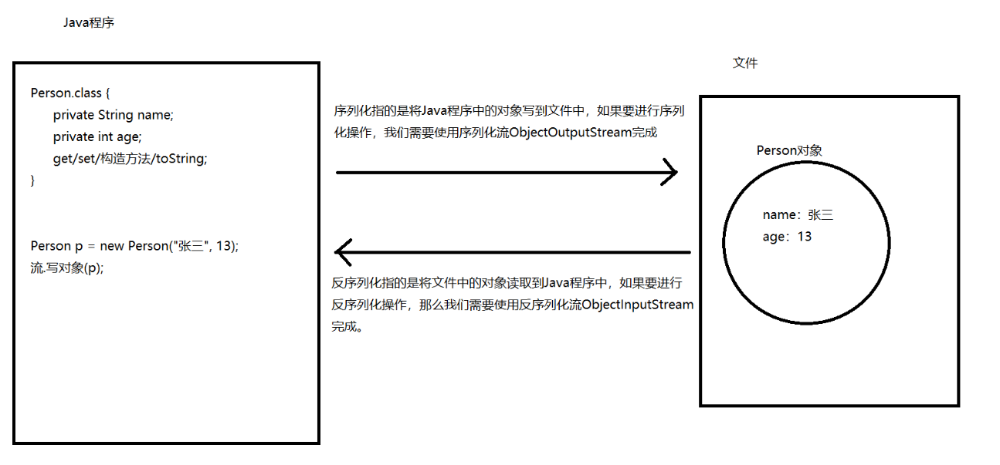

# 一. IO流的异常处理

## jdk7之前的异常处理

```java
/*
    JDK7之前IO流的异常处理
 */
public class Demo01Exception {
    public static void main(String[] args) {
        Writer w = null;
        try {
            //创建字符输出流对象
            w = new FileWriter("day11\\file01.txt");
            //写数据
            w.write("你好");
        } catch (IOException e) {
            e.printStackTrace();
        } finally {
            try {
                //必须流对象创建成功，那么我们才需要释放资源.
                //如果流对象创建成功了，那么w的值不是null
                if (w != null) {
                    //释放资源
                    w.close();
                }
            } catch (IOException e) {
                e.printStackTrace();
            }
        }
    }
}
```

## jdk7的异常处理

```java
/*
    JDK7以及之后的版本IO流异常的处理问题。

    在JDK7的时候，多了一种try...with...resource的语句，可以十分方便的处理IO流中的异常。
    try...with...resource就是一种特殊的try..catch语句。

    格式：
        try(创建流对象的代码) {
            ...
        } catch(异常类名 变量名) {
            ...
        }

    作用：
        在try后面小括号中创建的流对象，无论如何都会自动调用close方法。

    注意：
        在try后面小括号中可以创建多个流对象，多个流对象之间使用分号隔开。

 */
public class Demo02Exception {
    public static void main(String[] args) {
        try (Writer w = new FileWriter("day11\\file02.txt")) {
            //写数据
            w.write("雷猴");
        } catch (IOException e) {
            e.printStackTrace();
        }
    }
}

```

# 二. Properties【重点】

## Properties基本使用

```java
/*
    Properties是双列集合，叫做属性集。

    特点：
        1. Properties实现Map接口，拥有Map接口中的所有的方法。
        2. Properties没有泛型，里面的键和值都是字符串。
        3. Properties支持和流一起操作，可以从流中加载键值对【从文件中读取键值对】

    构造方法：
        Properties()：创建的是不包含任何元素的Properties集合。

    其他方法：
        Object setProperty(String key, String value)：添加键值对元素。
        (记住)String getProperty(String key)：根据键获取值。
        Set<String> stringPropertyNames()：获取Properties中所有的键并放入到Set集合中返回。
 */
public class Demo01Properties {
    public static void main(String[] args) {
        //创建Properties集合
        Properties p = new Properties();
        //Object setProperty(String key, String value)：添加键值对元素。
        p.setProperty("it001", "jack");
        p.setProperty("it002", "rose");
        p.setProperty("it003", "tony");
        //输出结果
        System.out.println(p);
        //String getProperty(String key)：根据键获取值。
        System.out.println("it001对应的值：" + p.getProperty("it001"));
        System.out.println("=================================");
        //Set<String> stringPropertyNames()：获取Properties中所有的键并放入到Set集合中返回。
        Set<String> set = p.stringPropertyNames();
        //遍历Properties集合
        for (String s : set) {
            System.out.println(s + "-" + p.getProperty(s));
        }
    }
}

```

## Properties从文件读取键值对

```java
/*
    Properties中和流相关的方法。
        void load(InputStream inStream)：参数要传递字节输入流
        void load(Reader reader)：参数要传递字符输入流
        load方法可以将文件中的键值对读取【加载】到Properties中

    Properties集合操作的文件是有要求的：
        1. 文件一般以.properties结尾【.properties文件一般叫做配置文件】（软性要求）
        2. 文件中的键值对必须按照下面格式保存（硬性规定）
            键=值
            键=值
            键=值

    Properties集合读取文件中键值对的步骤：
        1. 创建Properties集合。
        2. 创建输入流对象。
        3. 调用load方法，传递输入流对象，将文件中的键值对读取到Properties集合了。
        4. 释放资源。
 */
public class Demo02Properties {
    public static void main(String[] args) throws IOException {
        //1. 创建Properties集合。
        Properties p = new Properties();
        //2. 创建输入流对象。
        InputStream is = new FileInputStream("day11\\config.properties");
        //3. 调用load方法，传递输入流对象，将文件中的键值对读取到Properties集合了。
        p.load(is);
        System.out.println(p);
        //4. 释放资源。
        is.close();
    }
}

```


# 三. 缓冲流

## 普通流的效率问题

```java
/*
    使用字节流读写一个字节的方式复制文件并统计时间。
    20000ms
 */
public class Demo01FileCopy {
    public static void main(String[] args) throws IOException {
        //创建字节输入流
        InputStream is = new FileInputStream("day11\\aa.jpg");
        //创建字节输出流
        OutputStream os = new FileOutputStream("day11\\bb.jpg");
        //复制之前记录时间
        long start = System.currentTimeMillis();
        //开始读写，一次读写一个字节
        int i;
        while ((i = is.read()) != -1) {
            os.write(i);
        }
        //复制之后记录时间
        long end = System.currentTimeMillis();
        System.out.println(end - start);
        //释放资源
        os.close();
        is.close();
    }
}

```

## 字节缓冲流读写文件【读写字节】

```java
/*
    缓冲流

    字节缓冲流
        字节输入缓冲流：BufferedInputStream
        字节输出缓冲流：BufferedOutputStream
    字符缓冲流
        字符输入缓冲流：BufferedReader
        字符输出缓冲流：BufferedWriter

    缓冲流的特点是效率高，缓冲流可以起到加速的作用。
    缓冲流本身并不具备读或者写的功能，缓冲流的主要作用是对其他流进行加速，因为缓冲流内部有一个数组作为了缓冲区，所以可以加速。

    字节缓冲流的构造方法：
        BufferedInputStream(InputStream in): 参数要传递字节输入流。
        BufferedOutputStream(OutputStream out)：参数要传递字节输出流。

    字节缓冲流中读写的方法：
        字节缓冲流是属于字节流的，所以里面读写的方法和之前学习的字节流读写的方法一模一样。

    字节缓冲流的使用步骤：
        1. 创建字节缓冲流
        2. 读或写
        3. 释放资源

    使用字节缓冲流读写一个字节的方式复制文件，并统计时间。
 */
public class Demo02BufferedStream {
    public static void main(String[] args) throws IOException {
        //创建字节缓冲输入流
        BufferedInputStream bis = new BufferedInputStream(new FileInputStream("day11\\aa.jpg"));
        //创建字节缓冲输出流
        BufferedOutputStream bos = new BufferedOutputStream(new FileOutputStream("day11\\bb.jpg"));
        //记录时间
        long start = System.currentTimeMillis();
        //定义变量，用来接收读取到的字节
        int i;
        //开始循环
        while ((i = bis.read()) != -1) {
            bos.write(i);
        }
        //记录时间
        long end = System.currentTimeMillis();
        System.out.println(end - start);
        //释放资源
        bos.close();
        bis.close();
    }
}
```

## 字节缓冲流复制文件【读写数组】

```java
/*
    使用字节缓冲流读写一个字节数组的方式复制文件并统计时间
 */
public class Demo03BufferedStream {
    public static void main(String[] args) throws IOException {
        //创建字节缓冲输入流
        BufferedInputStream bis = new BufferedInputStream(new FileInputStream("day11\\aa.jpg"));
        //创建字节缓冲输出流
        BufferedOutputStream bos = new BufferedOutputStream(new FileOutputStream("day11\\bb.jpg"));
        //记录时间
        long start = System.currentTimeMillis();
        //采用读写数组的方式复制文件
        byte[] bArr = new byte[1024];
        int len;
        while ((len = bis.read(bArr)) != -1) {
            bos.write(bArr, 0, len);
        }
        //记录时间
        long end = System.currentTimeMillis();
        System.out.println(end - start);
        //释放资源
        bos.close();
        bis.close();
    }
}

```

## 字符缓冲流的基本使用

```java
/*
    字符缓冲流：
        字符输入缓冲流：BufferedReader
        字符输出缓冲流：BufferedWriter

    缓冲流的作用是加速，因为缓冲流内部有一个缓冲区。

    字符缓冲流构造方法：
        BufferedReader(Reader in)：参数要传递字符输入流。
        BufferedWriter(Writer out)：参数要传递字符输出流。

    字符缓冲流读写的方法：
        字符缓冲流是字符流，里面读写的方法和之前学习的字符流的读写方法一模一样

    字符缓冲流的使用步骤：
        1. 创建流
        2. 读或写
        3. 关闭流。
        【如果是字符输出流，需要刷新】

    在字符缓冲流中有两个特有的功能：
        BufferedWriter中有一个方法可以实现跨平台的换行
            void newLine():一个跨平台的换行符
        BufferedReader中有一个方法可以读取一行数据：
            String readLine()：读取一行数据并返回，如果已经读取结束了，返回null值。
            【注意：readLine不会读取换行符，只能读取换行符之前的内容】
 */
public class Demo04BufferedStream {
    public static void main(String[] args) throws IOException {
        method2();
    }

    /*
        String readLine()：读取一行数据并返回，如果已经读取结束了，返回null值。
     */
    public static void method2() throws IOException {
        //创建字符输入缓冲流
        BufferedReader br = new BufferedReader(new FileReader("day11\\file03.txt"));
        //使用循环读取
        //定义变量，用来保存每次读取到的一行数据
        String line;
        //开始循环
        /*
            条件位置做了哪些事情
                1. 通过字符输入缓冲流调用readLine方法读取一行数据。
                2. 将读取到的这行数据赋值给了变量line
                3. 判断line是否不等于null，如果line不是null，表示读取到了数据，就进行处理。
         */
        while ((line = br.readLine()) != null) {
            System.out.println(line);
        }

        /*
        //开始读取，一次读取一行数据
        String line = br.readLine();
        System.out.println(line);//窗含西岭千秋雪
        //继续读取
        line = br.readLine();
        System.out.println(line);//门泊东吴万里船
        //继续读取
        line = br.readLine();
        System.out.println(line);//null
        */
        //释放资源
        br.close();
    }

    /*
        void newLine():一个跨平台的换行符
     */
    public static void method() throws IOException {
        //创建流对象
        BufferedWriter bw = new BufferedWriter(new FileWriter("day11\\file03.txt"));
        //写数据
        bw.write("窗含西岭千秋雪");
        //void newLine():一个跨平台的换行符
        bw.newLine();
        bw.write("门泊东吴万里船");
        //关流
        bw.close();
    }
}
```

## 缓冲流练习

```java
/*
    要求：将出师表.txt中的文本内容恢复顺序。
    思路：
        将文件中的内容按照行为单位读取到集合中，在集合中进行排序，然后写到新的文件。
    步骤：
        1. 创建List集合，用来保存读取到的每行数据。
        2. 创建BufferedReader，用来读取。
        3. 开始读取，一次读取一行数据并放入到集合中。
        4. 释放资源。
        5. 对集合中的元素使用比较器进行排序【根据每个元素的首个字符进行排序】
        6. 创建BufferedWriter，用来写。
        7. 遍历集合，拿到集合中的每一个元素。
        8. 使用BufferedWriter将元素写到文件。
        9. 换行
        10. 刷新
        11. 释放资源

 */
public class Demo05Test {
    public static void main(String[] args) throws IOException {
        //1. 创建List集合，用来保存读取到的每行数据。
        List<String> list = new ArrayList<>();
        //2. 创建BufferedReader，用来读取。
        BufferedReader br = new BufferedReader(new FileReader("day11\\出师表.txt"));
        //3. 开始读取，一次读取一行数据并放入到集合中。
        String line;
        while ((line = br.readLine()) != null) {
            //line表示读取到的数据，将读取到的数据添加到集合中
            list.add(line);
        }
        //4. 释放资源。
        br.close();
        //5. 对集合中的元素使用比较器进行排序【根据每个元素的首个字符进行排序】
        Collections.sort(list, (o1, o2) -> o1.charAt(0) - o2.charAt(0));
        //6. 创建BufferedWriter，用来写
        BufferedWriter bw = new BufferedWriter(new FileWriter("day11\\outTeacherTable.txt"));
        //7. 遍历集合，拿到集合中的每一个元素。
        for (String str : list) {
            //8. 使用BufferedWriter将元素写到文件。
            bw.write(str);
            //9. 换行
            bw.newLine();
            //10. 刷新
            bw.flush();
        }
        //11. 释放资源
        bw.close();

    }
}
```

# 四. 转换流

## 编码表

```
编码和解码：
	编码：字符 -> 字节
	解码；字节 -> 字符

编码表（字符集）：字节和字符的对应关系表。

ASCII码表：    1字节        	有128个英文字母数字以及标点符号。
ISO8859-1(Latin)：   1字节  	有256个内容。包含了ASCII码表的内容以及拉丁文。
GB2312(1980)： 1/2字节          支持六千多个汉字或者字符
BIG5：		   1/2字节          支持繁体字
GBK： 		   1/2字节          支持两万多汉字或者字符。

国际标准码表：unicode，unicode中可以保存任何国家的任何语言，在unicode中每个字符都是使用两个字节保存的。在unicode8.0版本，甚至保存emoji

万国码：UTF-8
	UTF-32：每一个字符都使用4个字节保存。
	UTF-16：每一个字符都使用2/3/4个字节保存。
	UTF-8：每一个字符都使用1/2/3/4个字节保存
	
主要记住GBK和UTF-8

在GBK中每一个汉字占2个字节。
在UTF-8编码中每一个汉字占3个字节。

在IDEA中，使用的默认编码是UTF-8
在windows中， 使用的默认编码是UTF-8（最近win10更新，新版本的win10默认编码已经变成utf-8）
```

## 字符流读取乱码问题

```java
/*
    使用FileReader读取文件【采用GBK编码】中的数据

    因为文件采用的是GBK编码，而FileReader会采用idea默认的编码utf-8进行读取，此时两个编码不一致，就引发了乱码问题。

    如果想要读取GBK编码的文件，那么可以指定编码读取，如果要指定编码，需要使用转换流。

 */
public class Demo01FileReader {
    public static void main(String[] args) throws IOException {
        //创建FileReader对象
        Reader r = new FileReader("d:\\aa.txt");
        //开始读取，一次读取一个字符
        int i;
        while ((i = r.read()) != -1) {
            System.out.print((char)i);
        }
        //释放资源
        r.close();
    }
}

```

## 转换流指定编码读取

```java
/*
    InputStreamReader是转换流，用来读取，可以【按照指定编码】将文件中的数据读取Java程序中。
    InputStreamReader是字符流，可以以字符为单位进行读取。

    InputStreamReader的构造方法：
        InputStreamReader(InputStream in)：参数要传递字节输入流。使用这个构造方法创建的流将来会采用idea默认编码进行读取。
        InputStreamReader(InputStream in, String charsetName)：第一个参数是字节输入流，第二个参数是指定的编码方式，会采用指定的编码方式读取

    InputStreamReader的读取方法：
        InputStreamReader是字符流，所以里面读取方法的方法和字符流读取的方法是一模一样的。

    InputStreamReader使用步骤：
        1. 创建流
        2. 读数据
        3. 关闭流

    注意：
        使用转换流指定编码时，如果指定的编码不存在，那么会报错

 */
public class Demo02InputStreamReader {
    public static void main(String[] args) throws IOException {
        //readGBK();
        readUTF8();
    }

    /*
        读取UTF-8文件的数据
     */
    public static void readUTF8() throws IOException {
        //创建流
        InputStreamReader isr = new InputStreamReader(new FileInputStream("d:\\file02-utf8.txt"), "utf-8");
        //读取
        int i;
        while ((i = isr.read()) != -1) {
            System.out.print((char) i);
        }
        //释放资源
        isr.close();
    }


    /*
        读取GBK文件的数据
     */
    public static void readGBK() throws IOException {
        //1. 创建流，指定编码
        InputStreamReader isr = new InputStreamReader(new FileInputStream("d:\\file01-gbk.txt"), "gbk");
        //2. 读取数据
        int i;
        while ((i = isr.read()) != -1) {
            System.out.print((char) i);
        }
        //3. 释放资源
        isr.close();
    }
}
```

## 转换流指定编码写

```java
/*
    OutputStreamWriter是转换流，用来写，可以【指定编码】将Java程序中的数据写到文件中。
    OutputStreamWriter属于字符流，会以字符为单位写数据。

    OutputStreamWriter构造方法：
        OutputStreamWriter(OutputStream out)：参数要传递字节输出流，使用该构造方法创建的转换流将来会以idea默认编码去写数据。
        OutputStreamWriter(OutputStream out, String charsetName)：第一个参数是字节输出流，第二个参数是指定的编码方式。 会按照指定编码写数据。

    OutputStreamWrite写数据方法：
        OutputStreamWriter属于字符流，里面写数据的方法和我们之前学习的字符流写数据的方法一模一样。

    OutputStreamWriter使用步骤：
        1. 创建转换流，指定编码
        2. 调用write方法写数据。
        3. 刷新。
        4. 关流。


 */
public class Demo03OutputStreamWriter {
    public static void main(String[] args) throws IOException {
//        writeGBK();
        writeUTF8();
    }

    //向文件中写UTF-8编码的数据
    public static void writeUTF8() throws IOException {
        //创建OutputStreamWriter对象，并指定编码
        OutputStreamWriter osw = new OutputStreamWriter(new FileOutputStream("d:\\file04-utf8.txt"), "utf-8");
        //写数据
        osw.write("你好");
        //刷新
        osw.flush();
        //释放资源
        osw.close();
    }

    //向文件中写入GBK编码的数据
    public static void writeGBK() throws IOException {
        //创建OutputStreamWriter对象，并指定编码
        OutputStreamWriter osw = new OutputStreamWriter(new FileOutputStream("d:\\file03-gbk.txt"), "gbk");
        //写数据
        osw.write("你好");
        //刷新
        osw.flush();
        //释放资源
        osw.close();
    }
}

```

# 五. 序列化流

## 序列化和反序列化



## 序列化流的使用

```java
/*
    ObjectOutputStream是序列化流，可以将Java程序中的对象写到文件中。

    ObjectOutputStream构造方法：
        ObjectOutputStream(OutputStream out)：参数要传递一个字节输出流。

    ObjectOutputStream写对象的方法【特有方法】：
        void writeObject(Object obj)：将对象写到文件。

    ObjectOutputStream的使用步骤：
        1. 创建流
        2. 写对象
        3. 释放资源

    向文件中写的对象必须要实现Serializable接口。
 */
public class Demo01ObjectOutputStream {
    public static void main(String[] args) throws IOException {
        //1. 创建流
        ObjectOutputStream oos = new ObjectOutputStream(new FileOutputStream("day11\\file04.txt"));
        //2. 写Person对象
        Person p = new Person("张三丰", 100);
        oos.writeObject(p);
        //3. 关闭流
        oos.close();
    }
}

```

## 反序列化流的使用

```java
/*
    ObjectInputStream是反序列化流，可以将文件中的对象读取到Java程序中。

    ObjectInputStream构造方法：
        ObjectInputStream(InputStream in)：参数要传递字节输入流。

    ObjectInputStream读取对象的方法【特有方法】：
        Object readObject()：从文件中读取对象。

    ObjectInputStream使用步骤：
        1. 创建反序列化流
        2. 读取对象
        3. 释放资源

    注意事项：如果使用反序列化流读取对象时，对象所属的类不存在，那么会报错。
 */
public class Demo02ObjectInputStream {
    public static void main(String[] args) throws IOException, ClassNotFoundException {
        //1. 创建反序列化流
        ObjectInputStream ois = new ObjectInputStream(new FileInputStream("day11\\file04.txt"));

        //2. 读取对象
        Object obj = ois.readObject();
        System.out.println(obj);
        //Person p = (Person) obj;
        //System.out.println(p.getName() + "-" + p.getAge());

        //3. 释放资源
        ois.close();
    }
}
```

## 序列化中的static和transient

```java
/*
    注意：
        1. 被static修饰的属性不能被序列化。被static修饰的属性属于类，不属于对象，而序列化操作写的是对象。
        2. 如果我们不希望某个属性被序列化，同时不希望使用static关键字，那么可以使用transient。
           transient表示瞬态，被transient修饰的属性无法被序列化。
 */
public class Demo03StaticAndTransient {
    public static void main(String[] args) throws IOException, ClassNotFoundException {
        //writePerson();
        readPerson();
    }

    //定义方法，从文件中读取对象
    public static void readPerson() throws IOException, ClassNotFoundException {
        //创建反序列化流
        ObjectInputStream ois = new ObjectInputStream(new FileInputStream("day11\\file05.txt"));
        //读对象
        Object obj = ois.readObject();
        System.out.println(obj);
        //释放资源
        ois.close();
    }

    //定义方法，向文件中写Person对象
    public static void writePerson() throws IOException {
        //创建序列化流
        ObjectOutputStream oos = new ObjectOutputStream(new FileOutputStream("day11\\file05.txt"));
        //写对象
        oos.writeObject(new Person("张三丰", 100));
        //释放资源
        oos.close();
    }
}
```

## 序列化中的序列号

```java
public class Demo04SerialVersionUID {
    public static void main(String[] args) throws IOException, ClassNotFoundException {
        //writePerson();
        readPerson();
    }

    //定义方法，从文件中读取对象
    public static void readPerson() throws IOException, ClassNotFoundException {
        //创建反序列化流
        ObjectInputStream ois = new ObjectInputStream(new FileInputStream("day11\\file05.txt"));
        //读对象
        Object obj = ois.readObject();
        System.out.println(obj);
        //释放资源
        ois.close();
    }

    //定义方法，向文件中写Person对象
    public static void writePerson() throws IOException {
        //创建序列化流
        ObjectOutputStream oos = new ObjectOutputStream(new FileOutputStream("day11\\file05.txt"));
        //写对象
        oos.writeObject(new Person("张三丰", 100));
        //释放资源
        oos.close();
    }
}
```

```java
/*
    Serializable这个接口中没有任何的方法。
    这个接口只是起到一个标记作用，必须实现这个接口后，该类的对象才具备序列化的功能，才可以写到文件中。

    从文件中读取对象，当从文件中读取对象时，会对比文件中保存的版本号和class文件中的版本号是否一致，如果不一致，就会报错。如果要解决版本号冲突问题，我们可以给类固定一个版本号，不管该类怎么修改，版本号都不变。这样就解决了问题。

    我们可以在类中提供一个常量，该常量表示类的版本号。
    要求：
        1. private static final 修饰
        2. long类型的
        3. 必须叫做serialVersionUID
 */
public class Person implements Serializable{
    private String name;
    private /*static*/ /*transient*/ int age;

    //给类固定一个版本号，不管这个类怎么修改，版本号(序列号)永远是1
    private static final long serialVersionUID = 1L;

	get...set...构造方法...toString
}
```

## 序列化练习

```java
/*
    要求：
        1. 将存有多个学生对象的集合序列化操作，保存到list.txt 文件中。
        2. 反序列化list.txt ，并遍历集合，打印对象信息

    步骤：
        1. 创建集合
        2. 向集合中添加学生对象
        3. 创建序列化流对象
        4. 将集合对象写到文件中。
        5. 释放资源。
        6. 创建反序列化流
        7. 从文件中读取集合对象。
        8. 关流
        9. 遍历集合，输出集合中的每一个学生对象

    如果想要向文件中写多个对象，推荐的方式是先将这些对象放入到集合中，然后将集合写到文件中。
 */
public class Demo05Test {
    public static void main(String[] args) throws IOException, ClassNotFoundException {
        //1. 创建集合
        List<Student> list = new ArrayList<>();
        //2. 向集合中添加学生对象
        list.add(new Student("金莲", 18));
        list.add(new Student("门庆", 19));
        list.add(new Student("大郎", 20));
        //3. 创建序列化流对象
        ObjectOutputStream oos = new ObjectOutputStream(new FileOutputStream("day11\\list.txt"));
        //4. 将集合对象写到文件中。
        oos.writeObject(list);
        //5. 释放资源。
        oos.close();
        //6. 创建反序列化流
        ObjectInputStream ois = new ObjectInputStream(new FileInputStream("day11\\list.txt"));
        //7. 从文件中读取集合对象。
        List<Student> list2 = (List<Student>) ois.readObject();
        //8. 关流
        ois.close();
        //9. 遍历集合，输出集合中的每一个学生对象
        for (Student stu : list2) {
            System.out.println(stu);
        }
    }
}
```

```java
public class Student implements Serializable{
    private String name;
    private int age;

    get...set...构造方法...toString
}

```

# 六. 打印流

## 打印流的基本使用

```java
/*
    PrintStream是打印流。

    打印流的特点：
        1. 只有输出（写），没有输入（读）
        2. 写数据十分的方便

    PrintStream构造方法：
        PrintStream(String fileName)：参数要传递字符串的文件路径。
        PrintStream(File file)：参数要传递File对象。
        PrintStream(OutputStream out)：参数要传递字节输出流。

    PrintStream特有的写数据的方法：
        void print(任何类型)： 写任何类型的数据。
        void println(任何类型)： 写任何类型的数据并自动换行。

    PrintStream的使用步骤：
        1. 创建打印流对象
        2. 调用方法写数据。
        3. 释放资源
 */
public class Demo01PrintStream {
    public static void main(String[] args) throws FileNotFoundException {
        //1. 创建打印流对象
        PrintStream ps = new PrintStream("day11\\file06.txt");
        //2. 调用方法写数据。
        //void print(任何类型)： 写任何类型的数据。
        //ps.print("你好");
        //ps.print("我好");
        //void println(任何类型)： 写任何类型的数据并自动换行。
        ps.println("你好");
        ps.println("我好");

        //3. 释放资源
        ps.close();
    }
}
```

# 七. commons-io

```java
/*
    commons-io是由第三方（Apache）提供的IO流操作的工具包
    如果我们要使用第三方的工具包，一般要导入jar包
    jar包其实就是java的压缩包，里面保存了很多class文件。我们导入jar包后，可以直接使用里面的内容。

    导入jar包的步骤：
        1. 新建一个文件夹叫做lib
        2. 将jar包复制到lib文件夹下
        3. 点lib文件夹右键选择 Add as Library

    IOUtils中的方法：
        static int copy(InputStream input, OutputStream output)：复制文件。该方法适用于2G以下的文件。
        static long	copyLarge(InputStream input, OutputStream output)复制文件。该方法适用于2G以上的文件。

    FileUtils中的方法：
        static void	copyFileToDirectory(File srcFile, File destDir)：将文件(srcFile)复制到一个文件夹(destDir)中
        static void	copyDirectoryToDirectory(File srcDir, File destDir)：将一个文件夹(srcDir)复制到另一个文件夹(destDir)中
        static void	writeStringToFile(File file, String data)：向文件中写字符串数据
        static String readFileToString(File file)：从文件中读取数据，并返回读取到的内容
 */
public class Demo01CommonsIO {
    public static void main(String[] args) throws IOException {
        //IOUtils中的方法：
        //static int copy(InputStream input, OutputStream output)：复制文件。该方法适用于2G以下的文件。
        //IOUtils.copy(new FileInputStream("d:\\aa.jpg"), new FileOutputStream("d:\\bb.jpg"));

        //FileUtils中的方法：
        //static void copyFileToDirectory(File srcFile, File destDir)：将文件(srcFile)复制到一个文件夹(destDir)中
        //FileUtils.copyFileToDirectory(new File("d:\\aa.jpg"), new File("d:\\iotest"));

        //static void	copyDirectoryToDirectory(File srcDir, File destDir)：将一个文件夹(srcDir)复制到另一个文件夹(destDir)中
        //FileUtils.copyDirectoryToDirectory(new File("d:\\iotest"), new File("d:\\aaa"));

        //static void writeStringToFile(File file, String data)：向文件中写字符串数据
        //FileUtils.writeStringToFile(new File("day11\\file08.txt"), "你好");

        //static String readFileToString(File file)：从文件中读取数据，并返回读取到的内容
        String str = FileUtils.readFileToString(new File("day11\\出师表.txt"));
        System.out.println(str);
    }
}
```

