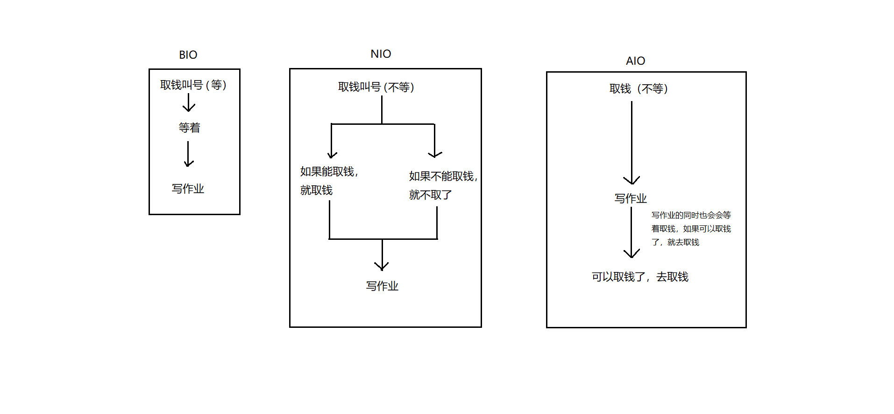
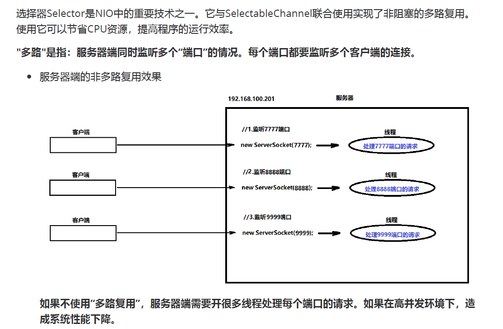

# NIO

## 各种IO介绍

```java
/*
	之前的网络编程
		服务器调用accept方法时会等着客户端来访问，客户端不来，服务器会一直等着。
		【去银行取钱，拿到号之后一直等着，如果没人叫自己，就一直等着】
    NIO的网络编程
    	服务器调用accept方法时，会看一下有没有客户端来连接，如果有，就接收客户端请求，如果没有就不等了
    	【去银行取钱，拿个号。如果此时叫我了，我就取钱。如果没有叫我，就不等了，去干别的事情钱也不取了】
    AIO的网络编程
		服务器调用accept方法时，会看一下有没有客户端来连接，如果有，就接收客户端请求，如果没有就先做一会儿自己的事情，等会再来接收客户端请求。
		【去银行取钱，拿个号。如果此时叫我了，我就取钱。如果没有叫我，就不等了，去干别的事情，干别的事情的同时会一直看着有没有叫自己，如果叫到自己了，就去取钱】


    BIO：同步阻塞IO
    NIO：同步非阻塞IO
    AIO：异步非阻塞IO

    NIO有三个重要的组成部分，Buffer， Channel， Selector
 */
```



# Buffer

## Buffer的创建

```java
/*
    Buffer是缓冲区，本质就是由数组组成的。
    在NIO中，数据都是要在缓冲区进行操作的。

    常见的缓冲区：
        ByteBuffer（记住）
        CharBuffer
        DoubleBuffer
        FloatBuffer
        IntBuffer
        LongBuffer
        ShortBuffer

    ByteBuffer创建三种方式
        static ByteBuffer allocate(int capacity)：创建一个字节缓冲区并返回，参数是缓冲区的长度（间接缓冲区）
        static ByteBuffer allocateDirect(int capacity)：创建一个字节缓冲区并返回，参数是缓冲区的长度（直接缓冲区）
        static ByteBuffer wrap(byte[] array)：根据字节数组创建字节缓冲区并返回（间接缓冲区）

    间接缓冲区：在Java的内存中创建的缓冲区。
    直接缓冲区：在系统内存中创建的缓冲区。
    间接缓冲区的创建和销毁效率比直接缓冲区要高，但是工作效率比直接缓冲区要低。

 */
public class Demo01Buffer {
    public static void main(String[] args) {
        // static ByteBuffer allocate(int capacity)：创建一个字节缓冲区并返回，参数是缓冲区的长度（间接缓冲区）
        ByteBuffer buffer = ByteBuffer.allocate(10);
        //将ByteBuffer转成数组，然后借助工具类Arrays.toString输出
        System.out.println(Arrays.toString(buffer.array()));

        //static ByteBuffer allocateDirect(int capacity)：创建一个字节缓冲区并返回，参数是缓冲区的长度（直接缓冲区）
        ByteBuffer buffer2 = ByteBuffer.allocateDirect(10);
        System.out.println(buffer2);

        //static ByteBuffer wrap(byte[] array)：根据字节数组创建字节缓冲区并返回（间接缓冲区）
        ByteBuffer buffer3 = ByteBuffer.wrap("hello".getBytes());
        System.out.println(Arrays.toString(buffer3.array()));
    }
}
```

## Buffer的put方法

```java
/*
    在ByteBuffer中有一些方法叫做put，可以向缓冲区中添加元素。
        ByteBuffer put(byte b)：向当前位置添加一个字节。
        ByteBuffer put(byte[] src)：向当前位置添加一个字节数组。
        ByteBuffer put(byte[] src, int offset, int length)：添加字节数组的一部分。参数offset是数组起始索引，参数length是元素个数

 */
public class Demo02BufferPut {
    public static void main(String[] args) {
        //获取缓冲区
        ByteBuffer buffer = ByteBuffer.allocate(10);
        //ByteBuffer put(byte b)：向当前位置添加一个字节。
        buffer.put((byte) 100);
        buffer.put((byte) 101);
        buffer.put((byte) 102);
        //ByteBuffer put(byte[] src)：向当前位置添加一个字节数组。
        byte[] bArr = {90, 91, 92, 93, 94};
        //buffer.put(bArr);

        //ByteBuffer put(byte[] src, int offset, int length)：添加字节数组的一部分。参数offset是数组起始索引，参数length是元素个数
        buffer.put(bArr, 1, 3);

        //输出
        System.out.println(Arrays.toString(buffer.array()));

    }
}
```

## Buffer的capacity方法

```java
/*
    在ByteBuffer中有一个方法叫做capacity，可以获取到缓冲区的容量
        int capacity()：返回缓冲区的容量。
 */
public class Demo03Capacity {
    public static void main(String[] args) {
        //获取缓冲区
        ByteBuffer buffer = ByteBuffer.allocate(10);
        //输出容量
        System.out.println("容量：" + buffer.capacity());
    }
}

```

## Buffer的limit方法

```java
/*
    在ByteBuffer中，有一个方法叫做limit，可以对缓冲区进行限制（比如限制缓冲区中只能使用前5个元素）
        int limit()：获取缓冲区的限制。
        Buffer limit(int newLimit)：设置缓冲区的限制。 参数表示新的限制，比如参数是5，就表示只能使用5个元素
 */
public class Demo04Limit {
    public static void main(String[] args) {
        //获取缓冲区
        ByteBuffer buffer = ByteBuffer.allocate(10);
        //输出
        System.out.println("容量：" + buffer.capacity() + "，限制：" + buffer.limit());
        //设置limit
        buffer.limit(2);
        System.out.println("容量：" + buffer.capacity() + "，限制：" + buffer.limit());

        //添加元素
        buffer.put((byte) 100);
        buffer.put((byte) 101);
        //限制了只能使用前两个元素，如果添加第三个，就会报错
        buffer.put((byte) 102);
    }
}

```

## Buffer的position方法

```java
/*
    在ByteBuffer中有一个方法叫做Position，可以获取以及设置缓冲区的元素位置(位置是几，将来就是在哪个位置添加)
        int position()：获取缓冲区的元素位置。
        Buffer position(int newPosition)：设置缓冲区的元素位置，参数表示新设置的位置。
 */
public class Demo05Position {
    public static void main(String[] args) {
        //获取缓冲区
        ByteBuffer buffer = ByteBuffer.allocate(10);
        //输出缓冲区的信息
        System.out.println("位置：" + buffer.position() + ", 限制：" + buffer.limit() + ", 容量：" + buffer.capacity());
        //添加
        buffer.put((byte) 100);
        buffer.put((byte) 101);
        buffer.put((byte) 102);
        //输出缓冲区的信息
        System.out.println("位置：" + buffer.position() + ", 限制：" + buffer.limit() + ", 容量：" + buffer.capacity());
        //设置缓冲区的位置
        buffer.position(0);
        System.out.println("位置：" + buffer.position() + ", 限制：" + buffer.limit() + ", 容量：" + buffer.capacity());
        buffer.put((byte) 50);
        buffer.put((byte) 51);
        //输出
        System.out.println(Arrays.toString(buffer.array()));
    }
}

```

## Buffer的mark方法

```java
/*
    在ByteBuffer中有一个方法叫做mark，可以设置缓冲区的标记
        Buffer mark()：设置缓冲区的标记
        Buffer reset()：恢复之前的标记

    调用mark方法时position是几，那么调用reset方法后恢复的position就是几。
 */
public class Deo06Mark {
    public static void main(String[] args) {
        //获取缓冲区
        ByteBuffer buffer = ByteBuffer.allocate(10);
        //输出缓冲区的信息
        System.out.println("位置：" + buffer.position() + ", 限制：" + buffer.limit() + ", 容量：" + buffer.capacity());
        //添加
        buffer.put((byte) 100);
        buffer.put((byte) 101);
        buffer.put((byte) 102);
        System.out.println("位置：" + buffer.position() + ", 限制：" + buffer.limit() + ", 容量：" + buffer.capacity());
        //设置标记
        buffer.mark();
        //添加
        buffer.put((byte) 103);
        buffer.put((byte) 104);
        System.out.println("位置：" + buffer.position() + ", 限制：" + buffer.limit() + ", 容量：" + buffer.capacity());
        //调用reset，恢复之间做标记是的位置.
        buffer.reset();
        System.out.println("位置：" + buffer.position() + ", 限制：" + buffer.limit() + ", 容量：" + buffer.capacity());
        buffer.put((byte) 10);
        buffer.put((byte) 11);
        //输出元素
        System.out.println(Arrays.toString(buffer.array()));
    }
}

```

## Buffer的其他方法

```java
/*
    ByteBuffer中的其他的方法：
        Buffer flip()：缩小limit的范围
            a. 将limit设置到position位置。
            b. 将position设置为0
            c. 丢弃标记

        Buffer clear():还原缓冲区的状态。
            a. 将limit设置到capacity
            b. 将position设置为0
            c. 丢弃标记
 */
public class Demo07OtherMethod {
    public static void main(String[] args) {
        //获取缓冲区
        ByteBuffer buffer = ByteBuffer.allocate(10);
        //输出缓冲区的信息
        System.out.println("位置：" + buffer.position() + ", 限制：" + buffer.limit() + ", 容量：" + buffer.capacity());
        //添加
        buffer.put((byte) 100);
        buffer.put((byte) 101);
        buffer.put((byte) 102);
        System.out.println("位置：" + buffer.position() + ", 限制：" + buffer.limit() + ", 容量：" + buffer.capacity());
        //缩小limit范围
        buffer.flip();
        System.out.println("位置：" + buffer.position() + ", 限制：" + buffer.limit() + ", 容量：" + buffer.capacity());
        //还原缓冲区状态
        buffer.clear();
        System.out.println("位置：" + buffer.position() + ", 限制：" + buffer.limit() + ", 容量：" + buffer.capacity());
    }
}
```

# Channel通道

## FileChannel复制文件

```java

/*
    Channel表示通道，在NIO中数据的读写都是使用通道完成的。我们可以将通道看成之前的流，只不过流是单向的，通道是双向的，通道既有
    读取的方法，也有写方法。

    常见的通道：
        FileChannel：从文件读取数据的
        DatagramChannel：读写UDP网络协议数据
        SocketChannel：读写TCP网络协议数据
        ServerSocketChannel：可以监听TCP连接

    通过NIO的方式复制文件，如果要对文件读写，需要使用FileChannel

    如何获取FileChannel：
        在FileInputStream和FileOutputStream中，有一个方法叫做getChannel，可以获取通道
            FileChannel getChannel()：获取通道。

    在通道（Channel）中还有用于读写的方法
        int write(ByteBuffer src):写数据，参数是缓冲区。
        int read(ByteBuffer dst)：读取数据，参数是缓冲区


 */
public class Demo01Channel {
    public static void main(String[] args) throws IOException {
        //创建字节流
        FileInputStream fis = new FileInputStream("d:\\aa.jpg");
        FileOutputStream fos = new FileOutputStream("d:\\bb.jpg");
        //获取通道
        FileChannel inChannel = fis.getChannel();
        FileChannel outChannel = fos.getChannel();
        //先定义缓冲区
        ByteBuffer buffer = ByteBuffer.allocate(1024);//
        //定义变量，表示读取到的字节个数
        int len;
        //开始循环
        while ((len = inChannel.read(buffer)) != -1) {
            //如果条件成立，就表示读取到了数据，那么就进行处理。
            //缩小limit范围（将limit设置到position位置），读取到几个，就让缓冲区中的几个元素是有效的。
            buffer.flip();
            //将读取到的数据写到目的地文件了
            outChannel.write(buffer);
            //重置缓冲区（将position设置为0，将limit设置到capacity，丢弃标记）
            buffer.clear();
        }
        //释放资源
        fos.close();
        fis.close();

    }
}

```

## RandomAccessFile 复制文件

```java
/*
    上例直接使用FileChannel结合ByteBuffer实现的管道读写，但并不能提高文件的读写效率。
    ByteBuffer有个子类：MappedByteBuffer，它可以创建一个“直接缓冲区”，并可以将文件直接映射至内存，可以提高大文件的读写效率。

    RandomAccessFile类（是一个可以设置读写模式的IO流类）
        RandomAccessFile(String name, String mode): 第一个参数是字符串的文件路径，第二个参数是模式。举例："r"表示只读。 "rw"表示读写

    RandomAccessFile其他的方法：
        FileChannel getChannel()：获取通道

    FileChannel获取MappedByteBuffer方法
        MappedByteBuffer map(FileChannel.MapMode mode, long position, long size)：获取直接缓冲区
            参数mode：表示模式
            参数position：表示起始位置
            参数size：映射的大小

    上面的方式不能复制超过2G的文件。
 */
public class Demo02FastCopy {
    public static void main(String[] args) throws IOException {
        //创建RandomAccessFile对象
        //创建的RandomAccessFile，绑定了源文件，模式只读
        RandomAccessFile source = new RandomAccessFile("d:\\aa.rar", "r");
        //创建的RandomAccessFile，绑定了目的地文件，模式读写
        RandomAccessFile target = new RandomAccessFile("d:\\bb.rar", "rw");
        //获取通道
        FileChannel inChannel = source.getChannel();
        FileChannel outChannel = target.getChannel();
        //记录时间
        long start = System.currentTimeMillis();
        //获取源文件大小
        long size = inChannel.size();
        //获取MappedByteBuffer缓冲区
        MappedByteBuffer mbbi = inChannel.map(FileChannel.MapMode.READ_ONLY, 0, size);
        MappedByteBuffer mbbo = outChannel.map(FileChannel.MapMode.READ_WRITE, 0, size);
        //遍历mbbi，将每一个字节都放入到mbbo缓冲区中.
        for (int i = 0; i < size; i++) {
            //获取到mbbi中索引为i的字节
            byte b = mbbi.get();
            //将获取到的放入到mbbo中
            mbbo.put(b);
        }
        //记录时间
        long end = System.currentTimeMillis();
        System.out.println(end - start);
        //释放资源
        target.close();
        source.close();
    }
}

```

## SocketChannel网络通信

**客户端**

```java
/*
    SocketChannel表示客户端通道，我们可以使用该类表示TCP中的客户端。

    如何获取SocketChannel
        static SocketChannel open()：获取SocketChannel

    SocketChannel方法：
        boolean connect(SocketAddress remote)：连接服务器。参数是目标服务器的IP地址以及端口号

 */
public class Demo01Client {
    public static void main(String[] args) throws IOException {
        //获取SocketChannel对象
        SocketChannel socketChannel = SocketChannel.open();
        //连接服务器
        socketChannel.connect(new InetSocketAddress("localhost", 8888));
        //给服务器发送数据
        //将要发送的数据封装到缓冲区中
        ByteBuffer buffer = ByteBuffer.wrap("你好".getBytes());
        //将数据发送给服务器
        socketChannel.write(buffer);
        //接收服务器回复过来的数据
        //创建一个长度是1024的缓冲区，用来接收服务器回复过来的数据
        ByteBuffer buffer2 = ByteBuffer.allocate(1024);
        //接收服务器的数据
        socketChannel.read(buffer2);
        //缩小limit限制
        buffer2.flip();
        //将缓冲区的内容转成字符串输出。
        System.out.println(new String(buffer2.array(), 0, buffer2.limit()));
        //释放资源
        socketChannel.close();
    }
}

```

**服务器**

```java
public class Demo02Server {
    public static void main(String[] args) throws IOException {
        //获取服务器通道
        ServerSocketChannel serverSocketChannel = ServerSocketChannel.open();
        //将服务器设置为非阻塞
        serverSocketChannel.configureBlocking(false);
        //给服务器绑定端口
        serverSocketChannel.bind(new InetSocketAddress(8888));
        while (true) {
            //监听客户端请求
            SocketChannel socketChannel = serverSocketChannel.accept();
            if (socketChannel == null) {
                System.out.println("还没有客户端来");
            } else {
                System.out.println("有客户端来连接了");
                //获取客户端发送过来的数据
                //创建ByteBuffer缓冲区，用来保存读取到的数据
                ByteBuffer buffer = ByteBuffer.allocate(1024);
                //通过通道接收数据
                socketChannel.read(buffer);
                //缩小limit范围
                buffer.flip();
                //输出读取到的内容
                System.out.println(new String(buffer.array(), 0, buffer.limit()));


                //给客户端回复数据
                //获取缓冲区，里面保存要回复的数据
                ByteBuffer buffer2 = ByteBuffer.wrap("收到".getBytes());
                //使用通道将数据写给客户端
                socketChannel.write(buffer2);
                //释放资源
                socketChannel.close();
            }
        }

    }
}

```

# Selector选择器

## 多路复用




## 选择器的使用

```java
/*
    Selector选择器可以实现多路复用的效果。我们可以使用一个Selector监听三个服务器的状态，哪个服务器有客户端来请求了，那么我们就可以
    让哪个服务器去处理客户端的请求。

    如何获取Selector选择器：
        static Selector open()：获取一个选择器。

    如何将通道注册到选择器：
        channel.configureBlocking(false)：将通道设置为非阻塞。
        SelectionKey key = channel.register(selector,SelectionKey.OP_ACCEPT)：参数selector表示选择器。SelectionKey.OP_ACCEPT表示监听服务器接受就绪事件

    Selector选择器中的方法：
        Set<SelectionKey> keys()：获取已经注册到选择器的通道（编号）并放入到Set集合中返回。 SelectionKey可以理解为通道的编号
        Set<SelectionKey> selectedKeys(): 获取已经连接的通道（编号）并放入到Set集合中返回。
        int select()：调用select方法后，程序会等着，一直到有客户端来连接。

    要求：使用Selector选择器监听三个服务器的状态。

 */
public class Demo01Selector {
    public static void main(String[] args) throws IOException {
        //创建三个服务器，并将三个服务器设置为非阻塞
        ServerSocketChannel serverSocketChannelOne = ServerSocketChannel.open();
        serverSocketChannelOne.bind(new InetSocketAddress(7777));
        serverSocketChannelOne.configureBlocking(false);//设置为非阻塞

        ServerSocketChannel serverSocketChannelTwo = ServerSocketChannel.open();
        serverSocketChannelTwo.bind(new InetSocketAddress(8888));
        serverSocketChannelTwo.configureBlocking(false);//设置为非阻塞

        ServerSocketChannel serverSocketChannelThree = ServerSocketChannel.open();
        serverSocketChannelThree.bind(new InetSocketAddress(9999));
        serverSocketChannelThree.configureBlocking(false);//设置为非阻塞

        //获取Selector选择器
        Selector selector = Selector.open();

        //让上面三个服务器通道注册到Selector选择器上
        serverSocketChannelOne.register(selector, SelectionKey.OP_ACCEPT);
        serverSocketChannelTwo.register(selector, SelectionKey.OP_ACCEPT);
        serverSocketChannelThree.register(selector, SelectionKey.OP_ACCEPT);

        //死循环，让程序一直执行(选择器一直监听服务器通道的状态)
        while (true) {
            //调用选择器的select方法，等着客户端来连接服务器
            selector.select();
            //如果程序向下执行，表示有客户端来连接了。就获取已经连接的服务器通道
            Set<SelectionKey> selectionKeys = selector.selectedKeys();
            //获取迭代器
            Iterator<SelectionKey> iterator = selectionKeys.iterator();
            //遍历
            while (iterator.hasNext()) {
                //获取遍历到的元素
                SelectionKey selectionKey = iterator.next();
                //通过selectionKey获取到通道
                ServerSocketChannel serverSocketChannel = (ServerSocketChannel) selectionKey.channel();
                //让服务器监听客户端请求
                SocketChannel socketChannel = serverSocketChannel.accept();
                //获取缓冲区，用来保存接收到的数据
                ByteBuffer buffer = ByteBuffer.allocate(1024);
                //进行读取
                socketChannel.read(buffer);
                //缩小缓冲区的limit范围
                buffer.flip();
                //输出读取到的内容
                System.out.println(new String(buffer.array(), 0, buffer.limit()));
                //客户端通道关闭
                socketChannel.close();
                //如果某个服务器处理完了客户端请求，那么就从集合中删除。
                iterator.remove();//删除遍历的元素
            }
        }
    }
}
```

```java
public class Demo02Client {
    public static void main(String[] args) {
        new Thread(() -> {
            try {
                //获取SocketChannel
                SocketChannel socketChannel = SocketChannel.open();
                //连接服务器
                socketChannel.connect(new InetSocketAddress("localhost", 7777));
                //准备缓冲区，保存要发送的数据
                ByteBuffer buffer = ByteBuffer.wrap("我要连接7777".getBytes());
                //将数据发给服务器
                socketChannel.write(buffer);
                //释放资源
                socketChannel.close();
            } catch (IOException e) {
                e.printStackTrace();
            }
        }).start();

        new Thread(() -> {
            try {
                //获取SocketChannel
                SocketChannel socketChannel = SocketChannel.open();
                //连接服务器
                socketChannel.connect(new InetSocketAddress("localhost", 8888));
                //准备缓冲区，保存要发送的数据
                ByteBuffer buffer = ByteBuffer.wrap("我要连接8888".getBytes());
                //将数据发给服务器
                socketChannel.write(buffer);
                //释放资源
                socketChannel.close();
            } catch (IOException e) {
                e.printStackTrace();
            }
        }).start();

        new Thread(() -> {
            try {
                //获取SocketChannel
                SocketChannel socketChannel = SocketChannel.open();
                //连接服务器
                socketChannel.connect(new InetSocketAddress("localhost", 9999));
                //准备缓冲区，保存要发送的数据
                ByteBuffer buffer = ByteBuffer.wrap("我要连接9999".getBytes());
                //将数据发给服务器
                socketChannel.write(buffer);
                //释放资源
                socketChannel.close();
            } catch (IOException e) {
                e.printStackTrace();
            }
        }).start();
    }
}
```

# AIO

```java
/*
    AIO有关的通道
        AsynchronousSocketChannel：TCP中的客户端异步通道
        AsynchronousServerSocketChannel：TCP中的服务器异步通道
        AsynchronousFileChannel：文件操作的异步通道
        AsynchronousDatagramChannel：UDP通信异步通道
 */
public class Demo01Server {
    public static void main(String[] args) throws IOException, ExecutionException, InterruptedException {
        //获取一个异步服务器通道
        AsynchronousServerSocketChannel asynchronousServerSocketChannel = AsynchronousServerSocketChannel.open();
        //绑定端口号
        asynchronousServerSocketChannel.bind(new InetSocketAddress(8888));
        //监听客户端的请求
        Future<AsynchronousSocketChannel> accept = asynchronousServerSocketChannel.accept();
        //调用get方法，获取服务器监听到的客户端通道
        AsynchronousSocketChannel asynchronousSocketChannel = accept.get();
        //创建ByteBuffer缓冲区，用来接收读取到的数据
        ByteBuffer buffer = ByteBuffer.allocate(1024);
        //调用read方法进行读取
        Future<Integer> readFuture = asynchronousSocketChannel.read(buffer);
        //判断如果read方法没有读取结束，那么就去干一些其他事情
        if (!readFuture.isDone()) {
            Thread.sleep(1000);
        }
        //缩小缓冲区limit限制
        buffer.flip();
        //输出读取到的结果
        System.out.println(new String(buffer.array(), 0, buffer.limit()));
        //释放资源
        asynchronousSocketChannel.close();
        asynchronousServerSocketChannel.close();
    }
}

```

```java
/*
    AsynchronousSocketChannel：TCP中的客户端异步通道
 */
public class Demo02Client {
    public static void main(String[] args) throws IOException, InterruptedException {
        //获取客户端异步通道
        AsynchronousSocketChannel asynchronousSocketChannel = AsynchronousSocketChannel.open();
        //连接服务器
        Future<Void> future = asynchronousSocketChannel.connect(new InetSocketAddress("localhost", 8888));
        //判断如果连接没有建立成功，就做一些其他事情
        if(!future.isDone()) {
            Thread.sleep(1000);
        }
        //让客户端给服务器发送数据
        ByteBuffer buffer = ByteBuffer.wrap("你好".getBytes());
        //调用方法，发送数据
        asynchronousSocketChannel.write(buffer);
        //释放资源
        asynchronousSocketChannel.close();
    }
}

```

# 同步异步&阻塞非阻塞

```java
同步和异步（线程通信的机制）
        同步：线程在完成某个功能时，得到结果之后才能做后面的事情【立即得到结果】
        异步：线程在完成功能的时候，不用得到结果也可以做后面的事情【不会立即得到结果】


阻塞和非阻塞（线程的状态）
        阻塞：线程在执行任务时，会挂起。
        非阻塞：线程在执行任务时，不会挂起，可以继续执行其他任务。
```

