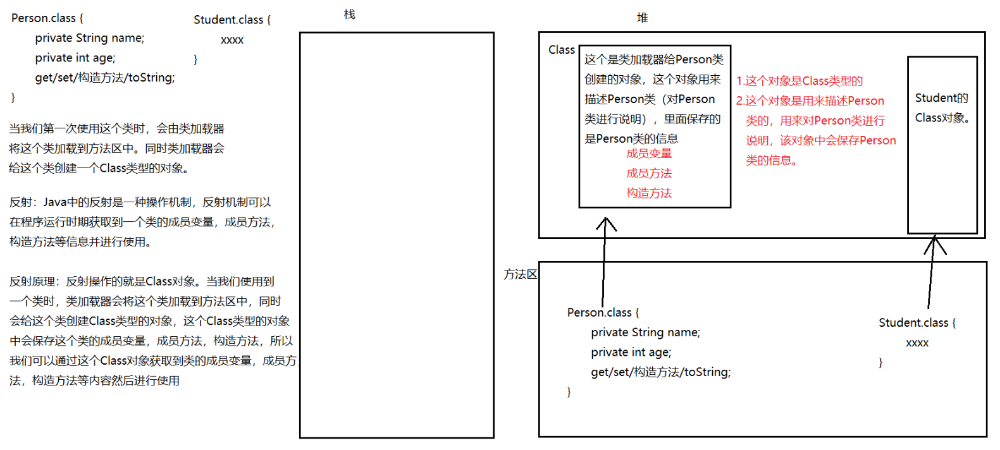

# 一. 反射【掌握】

## 反射概念

Java中的反射是一种机制，利用这种机制可以获取到类中的成员变量，成员方法，构造方法，并且进行使用。

> 反射就是换了一种形式去创建对象以及调用方法。



## 获取Class的三种方式

```java
/*
    Class对象的三种获取方式
        1. 通过对象调用getClass方法获取
            Class getClass()：获取Class对象
        2. 通过类的class属性获取（最简单）
            类名.class
        3. 通过Class的静态方法forName获取（最常用，最灵活）
            static Class forName(String className)：可以根据全类名（包含包的类名）获取类的Class对象

    一个类的Class对象只有一个，不管获取几次，获取的都是同一个Class对象。

 */
public class Demo01GetClass {
    //使用三种方式获取Person类的Class对象
    public static void main(String[] args) throws ClassNotFoundException {
        //1. 通过对象调用getClass方法获取
        //创建Person对象
        Person p = new Person();
        //调用getClass方法，获取Person类的Class对象
        Class clazz = p.getClass();
        System.out.println(clazz);

        //2. 通过类的class属性获取
        Class clazz2 = Person.class;
        System.out.println(clazz2);

        //3. 通过Class的静态方法forName获取
        Class clazz3 = Class.forName("com.itheima.demo01_reflect.Person");
        System.out.println(clazz3);

        //对比对象的地址值然后输出
        System.out.println(clazz == clazz2);
    }
}

```

## Class中的常见方法

```java
/*
    Class中的常见方法：
        String getName()：获取类的全限定类名（包含包的的类名）
        String getSimpleName(): 获取类的简单类名（不包含包的类名）
 */
public class Demo02ClassMethod {
    public static void main(String[] args) throws ClassNotFoundException {
        //获取Person类的Class对象
        Class clazz = Class.forName("com.itheima.demo01_reflect.Person");
        //String getName()：获取类的全限定类名（包含包的的类名）
        System.out.println(clazz.getName());//com.itheima.demo01_reflect.Person
        //String getSimpleName(): 获取类的简单类名（不包含包的类名）
        System.out.println(clazz.getSimpleName());//Person
    }
}

```

## 获取空参构造方法并使用

```java
/*
    使用反射获取到Person类的构造方法并进行使用。

    在Class中有一些方法可以获取到类的构造方法：
        Constructor[] getConstructors()：获取到类中所有的构造方法。
        Constructor getConstructor(Class... parameterTypes)：获取到类中指定的构造方法。 参数表示要获取的构造方法的参数列表。
        上面的方法只能获取到类中public权限的构造方法，其他权限无法获取。

    Constructor表示构造方法，里面的功能：
        T newInstance(Object... initargs)：通过该构造方法创建对象。
            参数initargs：表示通过构造方法创建对象时传递的实际参数。
            返回值：创建出来的对象。
 */
public class Demo03ReflectConstructor {
    public static void main(String[] args) throws ClassNotFoundException, NoSuchMethodException, IllegalAccessException, InstantiationException, InvocationTargetException {
        method2();
    }

    /*
        Constructor getConstructor(Class... parameterTypes)：获取到类中指定的构造方法。 参数表示要获取的构造方法的参数列表。
        要求：获取Person类中的空参数的构造方法，并使用该构造方法创建对象
     */
    public static void method2() throws ClassNotFoundException, NoSuchMethodException, IllegalAccessException, InvocationTargetException, InstantiationException {
        //获取Person类的Class
        Class clazz = Class.forName("com.itheima.demo01_reflect.Person");
        //获取Person类空参数的构造方法
        //public Person()：空参构造
        //因为getConstructor方法参数没有传递任何内容，所以表示我们获取的是空参数的构造方法
        Constructor c = clazz.getConstructor();
        //通过获取到的构造方法调用newInstance方法，使用获取到的构造方法创建对象
        //newInstance方法的参数表示使用构造方法创建对象时传递的实际参数，因为使用空参数的构造方法创建对象，所以不需要传递任何实际参数。所以newInstance方法参数留空不写
        //newInstance方法参数留空不写表示没有传递任何实际参数
        Object obj = c.newInstance();
        System.out.println(obj);
    }

    /*
        Constructor[] getConstructors()：获取到类中所有的构造方法。
     */
    public static void method() throws ClassNotFoundException {
        //获取Person类的Class
        Class clazz = Class.forName("com.itheima.demo01_reflect.Person");
        //获取所有的构造方法
        Constructor[] cs = clazz.getConstructors();
        //遍历数组，拿到每一个构造方法并输出
        for (Constructor c : cs) {
            System.out.println(c);
        }
    }
}
```

```java
public class Person {
    private String name;
    private int age;

    //定义属性表示爱好
    public String hobby;

    @Override
    public String toString() {
        return "Person{" +
                "name='" + name + '\'' +
                ", age=" + age +
                ", hobby='" + hobby + '\'' +
                '}';
    }

    public Person() {
    }

    private Person(String name) {
        this.name = name;
    }

    public Person(String name, int age) {

        this.name = name;
        this.age = age;
    }

    get...set...构造方法
}
```


## 获取带参数构造方法并使用

```java
/*
    使用反射获取有参数的构造方法并使用

    在Class中有一些方法可以获取到类的构造方法：
        Constructor[] getConstructors()：获取到类中所有的构造方法。
        Constructor getConstructor(Class... parameterTypes)：获取到类中指定的构造方法。 参数表示要获取的构造方法的参数列表。
        上面的方法只能获取到类中public权限的构造方法，其他权限无法获取。

    Constructor表示构造方法，里面的功能：
        T newInstance(Object... initargs)：通过该构造方法创建对象。
            参数initargs：表示通过构造方法创建对象时传递的实际参数。
            返回值：创建出来的对象。

    注意：任何类型都有class属性，包括基本数据类型
 */
public class Demo04ReflectConstructor {
    /*
        使用反射获取有参数的构造方法并使用
        public Person(String name, int age)
     */
    public static void main(String[] args) throws ClassNotFoundException, NoSuchMethodException, IllegalAccessException, InvocationTargetException, InstantiationException {
        //获取类的Class对象
        Class clazz = Class.forName("com.itheima.demo01_reflect.Person");
        //获取有参构造方法
        //Constructor getConstructor(Class... parameterTypes)：获取到类中指定的构造方法。 参数表示要获取的构造方法的参数列表。
        //因为调用getConstructor方法第一个参数传递的是String.class，第二个是int.class，表示要获取的构造方法有两个参数，第一个是String，第二个是int
        Constructor c = clazz.getConstructor(String.class, int.class);
        //使用获取到的构造方法创建对象。
        //T newInstance(Object... initargs)：通过该构造方法创建对象。
        //因为newInstance方法中传递了两个参数分别是"张三",100。所以表示使用构造方法创建对象时传递了张三,100这两个实际参数
        Object obj = c.newInstance("张三", 100); //相当于 new Person("张三", 100);
        //输出
        System.out.println(obj);
    }
}
```

## 暴力反射【不推荐】

```java
/*
    暴力反射（不推荐，会破坏封装性）
        暴力反射可以获取到类中任何权限（包括私有）的成员并进行使用。

    在Class中，有一些方法可以获取到类中的所有权限的构造方法：
        Constructor[] getDeclaredConstructors()：获取类中所有的构造方法
        Constructor getDeclaredConstructor(Class... parameterTypes)：获取类中指定的构造方法，参数是构造方法的参数列表
        上面的方法可以获取到任何权限的构造方法。

    通过上面的方法虽然可以获取到私有的成员，但是不能直接使用。
    因为Java中有一个权限检查机制，私有的东西是不能在外面使用的。
    我们可以取消这个权限检查机制。

    反射有关的类
        Constructor：构造方法
        Method：成员方法
        Field：成员变量

    上面这三个类都有一个父类叫做AccessibleObject，在AccessibleObject中有一个方法可以取消检查机制。
        void setAccessible(boolean flag)：如果参数是true表示取消权限检查
 */
public class Demo05ReflectConstructor {
    /*
        获取类中私有的构造方法并创建对象
        private Person(String name)
    */
    public static void main(String[] args) throws ClassNotFoundException, NoSuchMethodException, IllegalAccessException, InvocationTargetException, InstantiationException {
        //获取Person类的Class
        Class clazz = Class.forName("com.itheima.demo01_reflect.Person");
        //获取类中私有的构造方法
        //获取一个参数是字符串的构造方法
        Constructor c = clazz.getDeclaredConstructor(String.class);
        //取消检查机制
        c.setAccessible(true);
        //使用构造方法创建对象
        Object obj = c.newInstance("张三丰");
        //输出
        System.out.println(obj);
    }
}
```

## 反射创建对象的简便方式

```java
/*
    在Class中有一个方法叫做newInstance，可以十分方便的通过反射创建对象
        T newInstance(): 使用空参数的构造方法对象.

    如果要使用空参数的构造方法创建对象，那么不需要先获取构造方法，然后再通过构造方法创建对象了。
    我们可以直接使用Class中的newInstance方法创建对象
 */
public class Demo06ClassNewInstance {
    //通过反射使用空参数构造方法创建对象
    public static void main(String[] args) throws ClassNotFoundException, IllegalAccessException, InstantiationException {
        //获取Person类的Class
        Class clazz = Class.forName("com.itheima.demo01_reflect.Person");
        //通过Class对象调用newInstance方法
        Object obj = clazz.newInstance();
        System.out.println(obj);
    }
}

```

## 获取空参数成员方法并使用

```java
/*
    使用反射获取成员方法并使用。

    在Class中有一些功能，可以获取到类中的成员方法
        Method[] getMethods()：获取到类中所有的成员方法。
        Method getMethod(String name, Class... parameterTypes)：获取到类中指定的成员方法。参数name表示要获取的方法名，参数parameterTypes表示要获取的成员方法的参数列表。
        上面的两个功能只能获取到类中public权限的成员方法，其他权限无法获取。


    Method表示成员方法，里面的功能：
        Object invoke(Object obj, Object... args)：让该方法执行。
                参数obj：表示通过哪个对象调用了该方法。如果是调用的静态方法，该参数可以是null。
                参数args：表示调用该方法时传递的实际参数
                返回值：方法调用的返回值


 */
public class Demo07ReflectMethod {
    public static void main(String[] args) throws ClassNotFoundException, NoSuchMethodException, IllegalAccessException, InvocationTargetException, InstantiationException {
        method2();
    }

    /*
        获取类中空参数的成员方法并使用。
            public void sleep()
     */
    public static void method2() throws ClassNotFoundException, NoSuchMethodException, IllegalAccessException, InstantiationException, InvocationTargetException {
        //获取类的Class对象
        Class clazz = Class.forName("com.itheima.demo01_reflect.Person");
        //获取类中sleep方法
        //Method getMethod(String name, Class... parameterTypes)：获取到类中指定的成员方法。参数name表示要获取的方法名，参数parameterTypes表示要获取的成员方法的参数列表。
        //因为getMethod方法第一个参数传递的是sleep，所以表示要获取的方法名叫做sleep
        //因为getMethod方法的第二个参数是可变参数，所以我们可以传递任意个数据(0个1个或多个)，因为第二个参数没有传递任何内容，所以表示要获取的方法没有任何参数.
        Method m = clazz.getMethod("sleep");
        //创建Person对象，以后调用sleep方法的时候使用
        Object obj = clazz.newInstance();//obj表示Person对象
        //调用invoke方法，让方法执行
        //Object invoke(Object obj, Object... args)：让该方法执行。
        //因为通过m调用了invoke方法，m表示的是sleep方法，所以表示sleep方法执行了
        //因为invoke方法的第一个参数传递的是obj对象，所以表示通过obj调用了sleep方法
        //因为invoke方法的第二个参数我们没有传递任何数据，所以表示调用sleep方法时没有传递任何实际参数
        m.invoke(obj); //相当于 obj.sleep();

    }

    /*
        Method[] getMethods()：获取到类中所有的成员方法。
     */
    public static void method() throws ClassNotFoundException {
        //获取类的Class对象
        Class clazz = Class.forName("com.itheima.demo01_reflect.Person");
        //获取Person类中所有的成员方法
        Method[] ms = clazz.getMethods();
        //遍历输出
        for (Method m : ms) {
            System.out.println(m);
        }
    }
}

```

## 获取带空参数成员方法并使用

```java
/*
    反射获取有参数的成员方法并使用
    在Class中有一些功能，可以获取到类中的成员方法
        Method[] getMethods()：获取到类中所有的成员方法。
        Method getMethod(String name, Class... parameterTypes)：获取到类中指定的成员方法。参数name表示要获取的方法名，参数parameterTypes表示要获取的成员方法的参数列表。
        上面的两个功能只能获取到类中public权限的成员方法，其他权限无法获取。


    Method表示成员方法，里面的功能：
        Object invoke(Object obj, Object... args)：让该方法执行。
                参数obj：表示通过哪个对象调用了该方法。如果是调用的静态方法，该参数可以是null。
                参数args：表示调用该方法时传递的实际参数
                返回值：方法调用的返回值
 */
public class Demo08ReflectMethod {
    /*
        获取Person中的有参方法并使用
        public String eat(String foodName)
     */
    public static void main(String[] args) throws ClassNotFoundException, NoSuchMethodException, IllegalAccessException, InstantiationException, InvocationTargetException {
        //获取Person类的Class对象
        Class clazz = Class.forName("com.itheima.demo01_reflect.Person");
        //调用getMethod方法，获取Person类中的eat方法
        //Method getMethod(String name, Class... parameterTypes)：获取到类中指定的成员方法。参数name表示要获取的方法名，参数parameterTypes表示要获取的成员方法的参数列表。
        //因为getMethod方法第一个参数是eat，表示要获取的方法叫做eat
        //因为getMethod方法第二个参数传递的是String.class，表示要获取的方法只有一个参数是字符串类型
        Method m = clazz.getMethod("eat", String.class);
        //创建Person对象，以后调用方法的时候使用
        Object obj = clazz.newInstance();
        //让eat方法执行
        //Object invoke(Object obj, Object... args)：让该方法执行。
        //因为m表示的是eat方法，所以通过m调用invoke方法表示eat方法执行了
        //因为invoke方法中第一个参数是obj，所以表示通过obj对象调用了eat方法
        //因为invoke方法中第二个参数传递的是字符串"臭豆腐"，所以表示调用eat方法时传递的实际参数就是臭豆腐
        //invoke方法的返回值就是eat方法的返回值
        Object result = m.invoke(obj, "臭豆腐");//  -> obj.eat("臭豆腐");
        System.out.println("返回值：" + result);
    }
}

```

```java
public class Person {
    private String name;
    private int age;

    //定义属性表示爱好
    public String hobby;

    @Override
    public String toString() {
        return "Person{" +
                "name='" + name + '\'' +
                ", age=" + age +
                ", hobby='" + hobby + '\'' +
                '}';
    }

    //定义吃饭方法
    public String eat(String foodName) {
        System.out.println("吃" + foodName);
        return "粑粑";
    }

    //定义睡觉方法
    public void sleep() {
        System.out.println("睡觉觉");
    }

    public Person() {
    }

    private Person(String name) {
        this.name = name;
    }

    public Person(String name, int age) {

        this.name = name;
        this.age = age;
    }

    public String getName() {

        return name;
    }

    public void setName(String name) {
        this.name = name;
    }

    public int getAge() {
        return age;
    }

    public void setAge(int age) {
        this.age = age;
    }
}
```


## 反射练习

```java
/*
    通过读取文件的方式来决定创建哪个类的对象并调用哪个方法

    步骤：
        1. 新建配置文件，里面保存类名和方法名。
        2. 创建Properties集合
        3. 创建输入流
        4. 将文件中的键值对读取到Properties集合。
        5. 从Properties集合中获取到类名和方法名。
        6. 获取该类的Class对象
        7. 通过Class创建这个类的对象
        8. 通过Class调用getMethod获取要执行的方法。
        9. 让方法执行
 */
public class Demo10Test {
    public static void main(String[] args) throws IOException, ClassNotFoundException, IllegalAccessException, InstantiationException, NoSuchMethodException, InvocationTargetException {
        //2. 创建Properties集合
        Properties p = new Properties();
        //3. 创建输入流
        InputStream is = new FileInputStream("day14\\config.properties");
        //4. 将文件中的键值对读取到Properties集合。
        p.load(is);
        //5. 从Properties集合中获取到类名和方法名。
        String className = p.getProperty("className");
        String methodName = p.getProperty("methodName");
        //6. 获取该类的Class对象
        Class clazz = Class.forName(className);
        //7. 通过Class创建这个类的对象
        Object obj = clazz.newInstance();
        //8. 通过Class调用getMethod获取要执行的方法。
        Method m = clazz.getMethod(methodName);
        //9. 让方法执行
        m.invoke(obj);
    }
}

```

```java
public class Student {
    public void study() {
        System.out.println("学生学习");
    }
}

```

```java
public class Teacher {
    public void teach() {
        System.out.println("老师讲课");
    }
}

```

配置文件

```properties
className=com.itheima.demo01_reflect.Teacher
methodName=teach
```

# 二. 注解【会用】

## 注解介绍

```java
/*
    @XXX 表示注解

    介绍：
        1. 注解是从JDK5开始有的。
        2. 注解可以加在类上，方法上，成员变量上，局部变量上等等等...
        3. 程序可以根据注解完成一些功能。

    注解和注释区别：
        注释：是给程序员看的，注释不会被编译和执行。
        注解：是给程序看的，程序可以根据注解完成一些功能。

    常见的注解：
        @Override：用来验证一个方法是否是重写父类的方法。
        @FunctionalInterface：这个注解用来验证一个接口是否是函数式接口。
        @Deprecated：表示一个方法已经过时，不推荐使用了。
 */
public class Demo01Anno {
    public static void main(String[] args) {
        method();
    }

    @Deprecated
    public static void method() {
        System.out.println("这是一个非常厉害的方法，可以实现任何功能");
    }
}

```

## 自定义注解

```java
/*
    自定义注解

    格式：
        public @interface 注解名 {

        }
 */
```

```java
/*
    在注解中可以提供一些属性

    属性格式：
        数据类型 属性名();
        数据类型 属性名() default 默认值;

    注解中的属性的数据类型只能是下面几种：
        1. 八种基本类型 byte short int long float double boolean char
        2. String, Class, 枚举, 注解
        3. 上面所有类型的数组

    注解的使用格式：
        @注解名
        @注解名(属性名=属性值, 属性名=属性值)

    注解使用的注意事项：
        1. 如果注解中的属性没有默认值，那么在使用注解时必须要给该属性赋值
        2. 如果注解中的属性有默认值，那么在使用注解时，可以赋值，也可以不赋值。
        3. 如果注解中的属性是数组类型，那么在给该属性赋值时，可以使用大括号包裹多个元素
        4. 如果注解中的属性是数组类型，并且只需要给该属性赋值一个元素，那么也可以省略大括号。

 */
public @interface Student {
    //姓名属性
    String name();

    //年龄属性
    int age() default 0;

    //爱好属性
    String[] hobbies();
}
```

```java
public class Demo02Anno {

    @Student(name = "王叔叔", hobbies = "洗脚")
    public void method() {

    }
}
```


## 注解的特殊属性value

```java
/*
    注解中特殊的属性value：
        如果注解中只有一个没有默认值的属性，并且这个属性叫做value，那么在给该属性赋值时，可以省略属性名，否则必须写全.
 */
public @interface Book {
    //定义value属性，表示书名
    String value();

    int price() default 100;
}

```

```java
@Book("西游记")
public class Demo03Anno {

    @Book("xxx")
    int num;

    @Book("红楼梦")
    public void method(@Book("xxx") int num) {

    }
}

```


## Target元注解

```java
/*
    元注解
        元注解本身也是注解。
        元注解就是用来修饰注解的注解

    Java中常见的元注解：
        @Target：限制注解的使用位置
        @Retention：限制注解的生命周期
 */
@MyAnno
public class Demo01Anno {
    @MyAnno
    public void method() {

    }
}

```

```java

/*
    元注解就是修饰注解的注解。

    @Target就是一个元注解，这个元注解用来限制注解的使用位置。如果某个注解不使用@Target进行修饰，那么这个注解可以用在任何位置（类上,方法上,变量上...）

    在@Target这个元注解中，只有一个属性叫做value，那么在给该属性赋值时，可以省略属性名。这个value表示被@Target修饰的注解可以用在什么位置。
    这个属性value是ElementType数组类型的，ElementType是枚举类型，枚举其实就是一个特殊的类， 枚举中的属性都是自身的一个对象。
    我们在给value属性赋值时，可以使用ElementType中的各个属性，ElementType中的每一个属性都有自己的作用。
        ElementType.TYPE，类，接口
        ElementType.FIELD, 成员变量
        ElementType.METHOD, 成员方法
        ElementType.PARAMETER, 方法参数
        ElementType.CONSTRUCTOR, 构造方法
        ElementType.LOCAL_VARIABLE, 局部变量
 */
//@Target(ElementType.TYPE)//表示被修饰的注解可以用在类或接口上
//@Target(ElementType.METHOD)
@Target({ElementType.TYPE, ElementType.METHOD})//表示被修饰的注解可以用在类上或方法上
public @interface MyAnno {
}

```

## Retention元注解

```java
/*
    @Retention这个元注解用来设置注解的生命周期。
    如果某个注解不使用@Retention进行修饰，那么注解默认只在源代码阶段以及编译后的.class中有效，在运行时期内存中是没有的。

    @Retention中有一个属性叫做value，这个属性表示被修饰的注解的声明周期。这个value属性是RetentionPolicy类型的，RetentionPolicy
    是枚举类型。我们在使用@Retention这个注解时，可以给value属性赋值RetentionPolicy枚举的各个属性，在RetentionPolicy中，每一个属性
    都有自己的作用
        RetentionPolicy.SOURCE：表示被修饰的注解只在源代码阶段有效，在编译后的.class文件中以及运行时内存中是没有的。
        RetentionPolicy.CLASS：表示被修饰的注解在源代码阶段以及编译后的class文件中有效，在运行时期内存中是没有的。（默认值）
        RetentionPolicy.RUNTIME：表示被修饰的注解在源代码阶段，以及编译后的class文件中，以及运行时内存中都有效

 */
@Retention(RetentionPolicy.SOURCE)//被修饰的注解只在源代码阶段有效。
public @interface MyAnno1 {
}

```

```java
@Retention(RetentionPolicy.CLASS)//被修饰的注解在源代码阶段以及编译后的.class中有效。
public @interface MyAnno2 {
}

```

```java
@Retention(RetentionPolicy.RUNTIME)//被修饰的注解在源代码阶段，编译后的.class中，以及运行时内存中都有效。
public @interface MyAnno3 {
}

```

## 注解解析

```java
/*
    注解解析

    注解解析指的是获取注解中的内容(属性)然后进行使用。

    解析相关API：
        Annotation：是所有注解的根接口，所有注解都会默认实现这个接口。
        AnnotatedElement：这个接口中定义了有关操作注解的方法
            Annotation[] getAnnotations()：获取到所有的注解。
            T getAnnotation(Class annotationClass)：获取到指定的注解。 参数是注解的Class对象。
            boolean isAnnotationPresent(Class annotationClass)：判断是否有该注解。参数是注解的Class对象。

        反射有关的类【Class，Method，Constructor，Field】都实现了AnnotatedElement这个接口。
        注解解析要结合反射技术实现。
            如果要操作类上的注解，我们通过Class对象调用AnnotatedElement中的方法即可。
            如果要操作方法上的注解，我们通过Method对象调用AnnotatedElement中的方法即可
            如果要操作构造方法上的注解，我们通过Constructor对象调用AnnotatedElement中的方法即可

    要求：获取BookStore这个类上的注解，并输出注解的属性
    分析：如果要获取BookStore上的注解，我们可以先获取BookStore的Class对象，通过Class对象对注解进行操作.
 */
public class Demo01AnnoParse {
    public static void main(String[] args) throws ClassNotFoundException {
        //获取BookStore的Class对象
        Class clazz = Class.forName("com.itheima.demo04_anno_parse.BookStore");
        //先判断BookStore上面有没有Book注解，如果有，就获取
        boolean flag = clazz.isAnnotationPresent(Book.class);
        if (flag) {
            //通过Class对象调用方法获取注解
            Annotation a = clazz.getAnnotation(Book.class);
            //向下转型
            Book book = (Book) a;
            //输出注解中的属性
            System.out.println(book.name());
            System.out.println(book.price());
            System.out.println(book.author());
        }
    }
}
```

```java
@Retention(RetentionPolicy.RUNTIME)//让注解在运行时期内存中也有效
public @interface Book {
    //书名
    String name();
    //价格
    int price() default 100;
    //作者
    String author();
}

```

```java
@Book(name = "西游记", price = 58, author = "吴承恩")
public class BookStore {
}

```

## 注解练习

```java
/*
    模拟JUnit单元测试。

    要求：自定义@MyTest注解，然后在一个类中的多个方法上使用@MyTest注解，然后运行带有@MyTest注解的方法。

    步骤：
        1. 获取TestDemo的Class对象
        2. 创建TestDemo对象
        3. 通过Class对象调用getMethods获取所有的成员方法
        4. 遍历这些成员方法，拿到里面的每一个方法（Method）
        5. 判断该方法上有没有@MyTest注解。
        6. 如果有该注解，就让这个方法执行。
 */
public class Demo01Test {
    public static void main(String[] args) throws ClassNotFoundException, IllegalAccessException, InstantiationException, InvocationTargetException {
        //1. 获取TestDemo的Class对象
        Class clazz = Class.forName("com.itheima.demo05_anno_test.TestDemo");
        //2. 创建TestDemo对象
        Object obj = clazz.newInstance();
        //3. 通过Class对象调用getMethods获取所有的成员方法
        Method[] methods = clazz.getMethods();
        //4. 遍历这些成员方法，拿到里面的每一个方法（Method）
        for (Method method : methods) {
            //5. 判断该方法上有没有@MyTest注解。
            if (method.isAnnotationPresent(MyTest.class)) {
                //6. 如果有该注解，就让这个方法执行。
                method.invoke(obj);
            }
        }
    }
}

```

```java
public class TestDemo {
    public void testMethodA() {
        System.out.println("testMethodA....");
    }
    @MyTest
    public void testMethodB() {
        System.out.println("testMethodB....");
    }

    public void testMethodC() {
        System.out.println("testMethodC....");
    }
    @MyTest
    public void testMethodD() {
        System.out.println("testMethodD....");
    }

    public void testMethodE() {
        System.out.println("testMethodE....");
    }
}

```

```java
@Retention(RetentionPolicy.RUNTIME)//设置注解的生命周期
@Target(ElementType.METHOD)//设置注解的使用位置，只能用在方法上
public @interface MyTest {
}

```

# 三. 动态代理【看懂】

```java
/*
    动态代理可以对一个类（对象）的功能进行【增强】
        动态：会在程序运行时期创建一个代理类以及代理对象
        代理：会创建一个代理对象对原有功能进行增强

    在Proxy这个类中有一个方法叫做newProxyInstance，这个方法可以创建一个代理对象，并对另一个对象（被代理对象）进行增强。
        static Object newProxyInstance(ClassLoader loader, Class[] interfaces, InvocationHandler h)：该方法用来创建动态代理对象并将该对象返回。
            参数loader：表示类加载器。 固定写法 当前类.class.getClassLoader();
            参数interfaces：代理对象实现的接口，一般这些接口要和被代理对象一致。  固定写法：被代理对象.getClass().getInterfaces()
            参数h：该参数是InvocationHandler类型，InvocationHandler表示执行处理类（接口），这个接口中有一个方法叫做invoke
                Object invoke(Object proxy, Method method, Object[] args)：这个invoke方法会在每次动态代理对象调用方法时执行
                    参数proxy：表示代理对象
                    参数method：表示代理对象调用的方法。
                    参数args：表示代理对象调用方法时的实际参数。
                    返回值：代理对象调用方法的返回值
 */
public class Demo01Proxy {
    public static void main(String[] args) {
        //创建小汽车对象
        Carable car = new Car();

        //通过Proxy调用newProxyInstance创建动态代理对象
        Carable superCar = (Carable) Proxy.newProxyInstance(Demo01Proxy.class.getClassLoader(), car.getClass().getInterfaces(), new InvocationHandler() {
            @Override
            public Object invoke(Object proxy, Method method, Object[] args) throws Throwable {
                //对run方法进行增强，判断如果调用的方法是run，增加飞的操作
                if (method.getName().equals("run")) {
                    //如果当前调用的是run方法，输出小汽车在飞
                    System.out.println("小汽车在飞");
                }
                //放行（保留被代理对象的功能），让被代理对象调用方法
                Object result = method.invoke(car, args);
                return result;
            }
        });

        //调用方法
        superCar.run();

        System.out.println("=====================");
        String str = superCar.say();
        System.out.println(str);


        //Lambda表达式版本
        /*
        Carable superCar = (Carable) Proxy.newProxyInstance(Demo01Proxy.class.getClassLoader(), car.getClass().getInterfaces(), (proxy, method, argments) -> {
            //对run方法进行增强，判断如果调用的方法是run，增加飞的操作
            if (method.getName().equals("run")) {
                //如果当前调用的是run方法，输出小汽车在飞
                System.out.println("小汽车在飞bb");
            }
            //放行（保留被代理对象的功能），让被代理对象调用方法
            Object result = method.invoke(car, argments);
            return result;
        });
        */

    }
}
```

```java
/*
    该接口中定义的是小汽车的功能
 */
public interface Carable {
    //跑
    void run();

    //说话
    String say();
}

```

```java
public class Car implements Carable{
    //跑
    @Override
    public void run() {
        System.out.println("小汽车在跑");
    }

    //说话
    @Override
    public String say() {
        System.out.println("有人按喇叭了");
        return "嘀嘀";
    }
}

```

