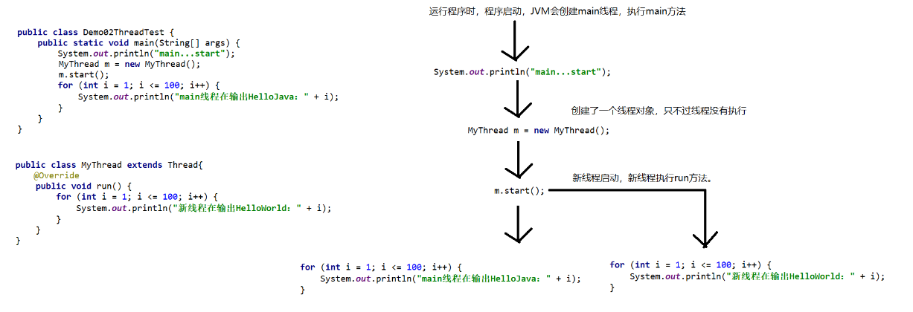

# 异常

## 异常的介绍

```java
/*
    异常指的是不正常，指的是程序出现了某些问题。

    在Java中所有的问题都可以使用一个类来表示，这个类叫做Throwable。
    Throwable是所有异常和错误的父类。

    Throwable
        |--Exception：异常。是程序中轻微的，可以挽回的问题。 相当于人得了感冒。
        |--Error： 错误。 是程序中严重的，不可挽回的问题。 相当于人得了绝症。

 */
public class Demo01Throwable {
}

```

## 异常的继承体系以及分类


## 异常产生的过程

```java
/*
    异常产生的过程。

    异常一旦抛出，那么代码就不会向下执行了。
 */
public class Demo02Exception {
    public static void main(String[] args) {
        //创建数组
        int[] arr = new int[2];//[0,0]
        //获取指定索引位置的元素
        int value = getValue(arr, 10);
        System.out.println(value);
    }

    /*
        定义方法，获取数组指定索引位置的元素。
            参数：数组，索引。
            返回值：获取到的元素
     */
    public static int getValue(int[] arr, int index) {
        //获取arr数组中index位置的元素
        int value = arr[index];
        return value;
    }
}

```


## throw关键字的使用

```java
/*
    throw关键字

    作用：用来手动向外抛出异常。

    格式：
        throw new 异常类名();

    注意：
        使用throw向外抛出的一定要是一个异常对象。

    在创建异常对象时可以在构造方法中传递一个字符串，该字符串表示异常信息。
 */
public class Demo03Throw {
    public static void main(String[] args) {
        //创建数组
        int[] arr = new int[2];//[0,0]
        //获取指定索引位置的元素
        int value = getValue(arr, 10);
        System.out.println(value);
    }

    /*
        定义方法，获取数组指定索引位置的元素。
            参数：数组，索引。
            返回值：获取到的元素
     */
    public static int getValue(int[] arr, int index) {
        //对index进行判断，如果索引不合法，手动向外抛出索引越界异常。
        if (index < 0 || index >= arr.length) {
            //拼接异常信息
            String msg = "数组索引的范围是0到" + (arr.length - 1) + "，您传递的索引是" + index;
            //手动向外抛出异常
            throw new ArrayIndexOutOfBoundsException(msg);
        }
        //获取arr数组中index位置的元素
        int value = arr[index];
        return value;
    }
}
```

## throws关键字的使用

```java
/*
    throw：用来手动抛出异常。
    throws：用来进行异常声明，声明某个方法有可能会抛出异常。

    格式：
        修饰符 返回值类型 方法名(参数列表) throws 异常类名 {
            方法体;
            return 返回值;
        }

    注意：
        1. 如果在方法内抛出了编译时异常，那么必须要使用throws进行声明
        2. 在调用使用throws声明异常的方法时，调用者方法如果不解决这个异常(try...catch)，必须也叫使用throws进行声明
        3. 如果在方法中抛出的是运行时异常，可以不使用throws进行使用。
        4. 如果方法中有可能抛出多个异常，那么我们需要使用throws进行多个异常的声明.
        5. 如果在方法中有可能抛出多个异常，那么我们也可以直接使用throws声明这些异常的父类异常.

 */
public class Demo05Throws {
    public static void main(String[] args) throws Exception{
        //method();
        method2();
    }

    public static void method4() throws Exception{
        //定义变量
        int num = 10;
        //判断num是奇数还是偶数，并根据判断抛出不同的异常.
        if (num % 2 == 0) {
            throw new IOException();
        } else {
            throw new SQLException();
        }
    }


    public static void method3() throws IOException, SQLException{
        //定义变量
        int num = 10;
        //判断num是奇数还是偶数，并根据判断抛出不同的异常.
        if (num % 2 == 0) {
            throw new IOException();
        } else {
            throw new SQLException();
        }
    }

    //抛出运行时异常
    public static void method2() {
        throw new RuntimeException();
    }

    //抛出编译时异常
    public static void method() throws Exception{
        //向外抛出编译时异常
        throw new Exception();
    }
}

```

## try...catch解决异常

```java
/*
    如果想要解决掉异常，而不是将异常向外抛，可以使用try...catch语句(捕获处理)

    格式：
        try {
            可能出现异常的代码
        } catch(异常类名 变量名) {
            出现异常后执行的代码
        }

    如果try中引发的异常和catch小括号中写的异常类名相同，那么catch可以捕获到该异常。


    执行流程：
        第一种情况：try中的代码没有任何异常，那么代码会跳过catch继续向下执行。
        第二种情况：try中的代码有异常并且catch捕获到了这个异常，那么代码会从try直接跳到catch中。
        第三种情况：try中的代码有异常但是catch没有捕获到这个异常，这个异常会依旧向外抛。

    两种处理异常的方式
        向外抛（甩锅）：throw throws
        解决异常： try...catch

 */
public class Demo06TryCatch {
    public static void main(String[] args) {
        try {
            System.out.println("1. try...start");
            Object obj = null;
            obj.toString();//NullPointerException
            System.out.println("2. try...end");
        } catch (ArrayIndexOutOfBoundsException e) {
            System.out.println("3. catch");
        }
        System.out.println("4. main...end");
    }
}
```


## finally代码块

```java
/*
    在try...catch语句后面可以追加finally代码块。

    格式：
        try {
            【A】可能会出现异常的代码
        } catch(要捕获的异常类名 变量名) {
            【B】出现异常后执行的代码
        } finally {
            【C】一定会执行的代码
        }

    finally代码块的特点：
        finally代码块的内容无论如何都会执行。

    执行流程：
        第一种情况：如果try中的代码没有异常，执行流程为【A】【C】
        第二种情况：如果try中的代码有异常，并且catch捕获到了这个异常，执行流程为 【A】【B】【C】
        第三种情况：如果try中的代码有异常，但是catch没有捕获到这个异常，执行流程为 【A】【C】向外抛出异常

    finally代码块的使用场景：
        一定要执行的代码放在finally代码块中，比如后期释放资源的操作(IO流中的关闭流，JDBC关闭连接)都是在finally代码块中执行的
 */
public class Demo07Finally {
    public static void main(String[] args) {
        try {
            System.out.println("1. try...start");
            Object obj = null;
            obj.toString();//NullPointerException
            System.out.println("2. try...end");
        } catch (ArrayIndexOutOfBoundsException e) {
            System.out.println("3. catch");
        } finally {
            System.out.println("4. finally");
        }
        System.out.println("5. main...end");
    }
}
```


## 编译时异常和运行时异常的区别

```java
/*
    运行时异常和编译时异常的区别。

    编译时异常：在编译时期必须要进行处理（try...catch或throws）
    运行时异常：在编译时期，可以处理，也可以不处理。
 */
public class Demo08Exception {
    public static void main(String[] args) {
        method2();
        //method();
    }

    //抛出运行时异常
    public static void method2() {
        throw new RuntimeException();
    }

    //抛出编译时异常
    public static void method() throws Exception{
        throw new Exception();
    }
}

```


## 继承关系中方法重写时的异常处理

```java
public class Fu {
    public void method() {

    }

    public void function() throws IOException{

    }
}

```

```java
/*
    在继承关系中方法重写时异常的处理。

    在方法重写时，如果父类方法没有抛出异常，那么子类重写的方法也不能抛，如果子类方法有异常，只能try...catch
    在方法重写时，如果父类方法抛出了异常，那么子类方法可以抛，也可以不抛。如果子类方法向外抛，要么抛出和父类方法异常一样的异常，要么抛出父类方法异常的子类异常。


    注意：上面所说的规则只适用于编译时异常。
 */
public class Zi extends Fu{

    //父类方法中向外抛出的是IOException,子类方法除了可以抛出IOException之外，也可以抛出IOException的子类。
    @Override
    public void function() throws FileNotFoundException {

    }


    @Override//注解，该注解用来验证该方法是否是重写父类的方法。
    public void method() {
        String str = "2000-10-10 12:12:12";
        SimpleDateFormat sdf = new SimpleDateFormat("yyyy-MM-dd HH:mm:ss");
        try {
            Date date = sdf.parse(str);
            System.out.println(date);
        } catch (ParseException e) {

        }
    }
}

```


## 多异常处理的注意事项

```java
/*
    try后面可以追加多个catch，多个catch可以进行多异常的捕获处理

    格式：
        try {
            可能出现异常的代码;
        } catch(要捕获的异常类名 变量名) {
            出现异常后执行的代码;
        } catch(要捕获的异常类名 变量名) {
            出现异常后执行的代码;
        } catch(要捕获的异常类名 变量名) {
            出现异常后执行的代码;
        }

    执行流程：
        第一种情况：如果try中的代码没有异常，所有的catch都不执行。
        第二种情况：如果try中的代码有异常， 哪个catch先捕获到异常，那么就执行哪个catch后面的语句。
        第三种情况：如果try中代码有异常，但是所有的catch都没有捕获到，那么这个异常依旧会向外抛。

    注意：
        在进行多catch异常处理时，父类异常不能放在子类异常的前面，因为父类异常的catch会拦截掉所有能捕获到的异常。
 */
public class Demo09TryCatchCatch {
    public static void main(String[] args) {
        try {
            System.out.println("1. try...start");
            Object obj = null;
            obj.toString();//NullPointerException
            System.out.println("2. try...end");
        } catch (ArrayIndexOutOfBoundsException e) {
            System.out.println("3. ArrayIndexOutOfBoundsException");
        } catch (NullPointerException e) {
            System.out.println("4. NullPointerException");
        } catch (ClassCastException e) {
            System.out.println("5. ClassCastException");
        } catch (Exception e) {
            System.out.println("6. Exception");
        }

        System.out.println("7. main...end");
    }
}
```


##  Throwable中操作异常信息的方法

```java
/*
    在Throwable中有一些方法可以获取异常信息。
        void printStackTrace()：使用标准的错误流将异常信息输出到控制台【非常详细的异常信息】
        String getMessage()：获取异常信息的字符串【简短的异常信息】

    上面的这些方法要通过异常对象去调用【要通过捕获到的异常对象调用】
 */
public class Demo10ThrowableMethod {
    public static void main(String[] args) {
        try {
            int[] arr = new int[2];
            System.out.println(arr[10]);//throw new ArrayIndexOutOfBoundsException(..);
        } catch (ArrayIndexOutOfBoundsException e) {//e = new ArrayIndexOutOfBoundsException(..);
            //变量e就表示捕获到的异常对象。我们可以通过e调用方法获取到异常对象中的异常信息。
            //void printStackTrace()：使用标准的错误流将异常信息输出到控制台【非常详细的异常信息】
            //e.printStackTrace();
            // String getMessage()：获取异常信息的字符串【简短的异常信息】
            String msg = e.getMessage();
            System.out.println(msg);
        }
        //System.out.println("main...end");
    }
}

```


## 自定义异常

```java
/*
    自定义异常

    如何自定义异常：认贼作父

    如果我们定义的类继承的是编译时异常，那么这个类就是编译时异常。
    如果我们定义类继承的是运行时异常，那么这个类运行时异常。

    一般来说，定义编译时异常都会继承Exception，定义运行时异常都会继承RuntimeException
 */

//继承RuntimeException，这样该类就变成了运行时异常
public class AgeException extends RuntimeException{
    //提供空参数构造方法
    public AgeException() {
    }

    //提供一个带参数的构造方法，用来接收异常信息，然后给异常信息赋值。
    public AgeException(String message) {
        //调用父类的构造方法，将异常信息传给父类。
        super(message);
    }
}

```

```java
/*
    定义一个方法，该方法可以键盘录入学生姓名和年龄，根据姓名和年龄创建对象，并且将学生对象返回。
    注意：要求年龄不能为负数，如果年龄为负数要求抛出异常。

    在main方法调用上面定义的方法，获取获取学生对象。
 */
public class Demo01Test {
    public static void main(String[] args) {
        try {
            //调用createStudent方法，获取学生对象
            Student stu = createStudent();
            System.out.println(stu);
        } catch (AgeException e) {
            //获取简短的异常信息并输出
            System.out.println(e.getMessage());
        } catch (Exception e) {
            //兜底的catch，上面捕获不到的异常，都使用这个catch捕获。防止异常抛给JVM
            System.out.println("服务器忙");
            e.printStackTrace();
        }

    }

    /*
        定义方法，用来获取学生对象【学生对象的属性来源于键盘录入，年龄不能为负数】
            参数：没有
            返回值：学生
     */
    public static Student createStudent() {
        //键盘录入姓名和年龄
        Scanner sc = new Scanner(System.in);
        System.out.println("请你键盘录入学生的姓名");
        String name = sc.nextLine();
        System.out.println("请你键盘录入学生的年龄");
        int age = Integer.parseInt(sc.nextLine());
        //判断年龄是否是负数，如果年龄是负数表示有问题，那么抛出异常
        if (age < 0) {
            //创建对象时可以在构造方法位置传递异常信息。
            //throw new RuntimeException("年龄是负数，不行的哦");
            throw new AgeException("年龄是负数，哈哈哈，不可以");
        }
        //根据键盘录入的姓名和年龄创建对象
        return new Student(name, age);
    }
}
```

```java
public class Student {
    private String name;
    private int age;

    @Override
    public String toString() {
        return "Student{" +
                "name='" + name + '\'' +
                ", age=" + age +
                '}';
    }

    public Student() {
    }

    public Student(String name, int age) {

        this.name = name;
        this.age = age;
    }

    public String getName() {

        return name;
    }

    public void setName(String name) {
        this.name = name;
    }

    public int getAge() {
        return age;
    }

    public void setAge(int age) {
        this.age = age;
    }
}
```


# 线程

## 进程的介绍


## 线程的介绍


## 并发和并行


## 程序中的main线程

```java
/*
    每一个程序都至少包含一个线程，我们写的Java程序也一样。

    当程序启动时，JVM会创建一个main线程，并执行main方法。

    在程序中只有一个执行线程main线程，该程序是单线程程序。
    单线程程序同时只能做一件事情，如果想要同时做多件事情，可以使用多线程程序。
 */
public class Demo01MainThread {
    public static void main(String[] args) {
        System.out.println("main...start");
        //输出100次HelloWorld
        for (int i = 1; i <= 100; i++) {
            System.out.println("HelloWorld:" + i);
        }
        //输出100次HelloJava
        for (int i = 1; i <= 100; i++) {
            System.out.println("HelloJava:" + i);
        }
        System.out.println("main...end");
    }
}

```

## 多线程程序的第一种实现方式

```java
/*
    在Java中有一个类叫做Thread，这个类表示线程类，我们可以使用这个类完成多线程程序。

    多线程的第一种实现方式：
        1. 定义类继承Thread
        2. 重写Thread中的run方法，并在run方法中定义线程要执行的任务。
        3. 创建Thread子类对象。
        4. 通过Thread子类对象调用start方法，启动线程，线程会执行自己的run方法。

    Thread中的run方法：
        void start()：让线程执行，线程会执行自己的run方法。

 */
public class Demo02ThreadTest {
    public static void main(String[] args) {
        System.out.println("main...start");
        //创建Thread子类对象
        //表示创建了一个线程，只不过该线程并没有执行。
        MyThread m = new MyThread();
        //通过Thread子类对象调用start方法，启动线程，线程会执行自己的run方法。
        m.start();
        //输出100次HelloJava
        for (int i = 1; i <= 100; i++) {
            System.out.println("main线程在输出HelloJava：" + i);
        }
    }
}
```

```java
/*
    Thread是线程类，当MyThread继承Thread后，MyThread也就变成了线程类。
 */
public class MyThread extends Thread{
    //重写run方法，在run方法中定义线程要执行的任务（输出100次HelloWorld）
    @Override
    public void run() {
        for (int i = 1; i <= 100; i++) {
            System.out.println("新线程在输出HelloWorld：" + i);
        }
    }
}

```

## 多线程的执行流程




## Thread中的方法

```java
/*
    Thread中的常见方法

    构造方法：
        Thread()：空参数的构造方法。
        Thread(String name)：一个参数是字符串的构造方法，参数表示线程名字。

    其他方法：
        String getName()：获取线程名字。
        void setName(String name)：设置线程名字。
        static Thread currentThread()：获取当前正在执行的线程对象。
        static void sleep(long millis)：线程休眠，参数是休眠的毫秒值。
 */
public class Demo01ThreadMethodTest {
    public static void main(String[] args) {
        //创建MyThread对象
        MyThread m = new MyThread("大黄");
        //m.setName("旺财");
        //调用start方法启动线程
        m.start();

        //获取main线程的名字。
        //先获取当前正在执行的线程对象，然后调用getName获取线程名字
        //static Thread currentThread()：获取当前正在执行的线程对象【该方法是通过哪个线程调用的，那么获取到的就是哪个线程对象】
        Thread mainThread = Thread.currentThread();
        System.out.println(mainThread.getName());


        //创建线程并调用start方法启动
        //new MyThread().start();
        //new MyThread().start();
        //new MyThread().start();
    }
}
```

```java
public class MyThread extends Thread{

    //提供构造方法，用来设置线程名字
    public MyThread(String name) {
        super(name);
    }

    //重写run方法，定义线程要执行的任务
    @Override
    public void run() {
        //setName("狗蛋");
        System.out.println(getName() + "执行了");
    }
}

```

```java
/*
    Thread的sleep方法
        static void sleep(long millis)：线程休眠，参数是休眠的毫秒值。
 */
public class Demo02Sleep {
    public static void main(String[] args) throws InterruptedException {
        System.out.println("开始...");
        //让程序停(休眠)5秒钟(5000毫秒)
        Thread.sleep(5000);
        System.out.println("结束...");
    }
}

```

## 多线程的第二种实现方式

```java
/*
    多线程的第二种实现方式

    实现步骤：
        1. 定义类，然后实现Runnable接口。
        2. 重写Runnable接口中的run方法，在run方法中定义线程要执行的任务。
        3. 创建Runnable实现类对象。
        4. 创建Thread线程对象，并将Runnable实现类对象作为参数传递。
        5. 调用线程对象的start方法，启动线程，线程会执行对应的run方法。

    多线程有两种实现方式
        1. 继承Thread类
        2. 实现Runnable接口

    推荐第二种，原因：
        1. 解决了Java中类与类单继承的局限性。
        2. 降低了耦合性（关联性）
        3. Runnable中只有一个run方法，没有getName，sleep，setName...，功能更加纯粹，我们只需要在里面关注线程要执行的任务。

 */
public class Demo01RunnableTest {
    public static void main(String[] args) {
        //创建Runnable实现类对象【task对象表示线程要执行的任务】
        Task task = new Task();
        //创建Thread线程对象，并将Runnable实现类对象作为参数传递。
        Thread t = new Thread(task);//表示将线程和task任务进行绑定，该线程要执行的任务是task中的run方法。
        //调用线程对象的start方法，启动线程，线程会执行对应的run方法。
        t.start();
        //输出100次HelloJava
        for (int i = 1; i <= 100; i++) {
            System.out.println("main线程在输出HelloJava：" + i);
        }

    }
}

```

```java
/*
    在java中Thread类才表示线程类。
    Task这个类和Thread没有关系，所以Task并不是线程类。
    我们可以将Task看成线程任务类，因为该类只有一个run方法，在该类中只需要关注线程要执行的任务。
 */
public class Task implements Runnable{
    //定义线程要执行的任务【输出100次HelloWorld】
    @Override
    public void run() {
        for(int i = 1; i <= 100; i++) {
            System.out.println(Thread.currentThread().getName() + "在输出HelloWorld:" + i);
        }
    }
}

```


## 匿名内部类实现多线程

```java
/*
    匿名内部类完成多线程。

    匿名内部类的格式：
        new 父类或接口() {
            //重写的方法
        }
    举例：
        new Person() {
            ...
        }
        创建的是Person的子类对象，只不过子类叫什么，我们不知道，因为他是匿名的。

    作用：
        临时定义某个类的子类，并创建该子类的对象.
 */
public class Demo01InnerThread {
    public static void main(String[] args) {
        //创建Runnable的实现类对象【匿名内部类】
        Runnable r = new Runnable() {
            public void run() {
                System.out.println(Thread.currentThread().getName() + "执行了");
            }
        };
        //创建线程对象并启动
        new Thread(r).start();

        //最终版
        //创建线程对象并启动
        new Thread(new Runnable() {
            @Override
            public void run() {
                System.out.println(Thread.currentThread().getName() + "执行了");
            }
        }).start();
    }
}
```

